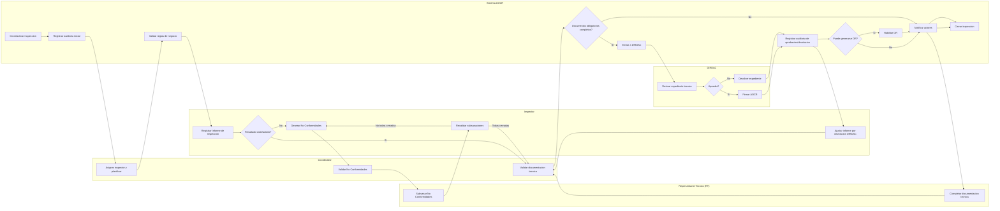

# BPMN Optimizado - Modulo de Inspeccion AOCR

Fecha: 2026-03-24
Objetivo: redefinir el flujo de inspeccion AOCR con base en estados, swimlanes claras y reutilizacion de componentes existentes, sin romper rutas, DAOs ni tablas actuales.

## 1. Base real del sistema actual

Implementacion existente reutilizable:

- Controlador principal: CapaPresentacion/Controllers/InspeccionController.cs
- Orquestacion incremental existente: CapaNegocio/Services/InspeccionService.cs
- Maquina de estados actual: CapaDatos/Constants/EstadosInspeccion.cs
- Historial de cambios de estado: CapaDatos/DAOs/InspeccionHistorialDAO.cs
- Registro de NC/Hallazgos: CapaNegocio/InspeccionBL.cs + HallazgoDAO
- Validacion documental: CapaNegocio/Services/ValidacionDocumentalService.cs
- Auditoria transversal: CapaNegocio/Services/AuditoriaService.cs
- Habilitacion OR: CapaNegocio/Services/IntegracionInspeccionOrService.cs

Hallazgos del flujo actual:

- Hay doble via para mover estado: CambiarEstado generico y acciones alias como Evaluar, Subsanar, Revalidar, SolicitarNueva y RegistrarNoConforme.
- El registro de resultado existe por dos caminos: RegistrarResultado en controller y EvaluarInspeccion en service.
- La logica de NC y observaciones esta repartida entre Hallazgo, estados OBSERVADA/OBSERVACION_DOCUMENTAL y carga de documentos por solicitante.
- Los roles de coordinacion estan mezclados dentro del mismo bloque tecnico: Coordinador, Jefatura, Direccion, Legal y aliases.
- El sistema ya valida documentos por etapa, pero la validacion no esta reflejada como gateway BPMN central del flujo.
- La generacion de OR ya existe como evento posterior al cierre, pero hoy depende de cierre tecnicamente alcanzado y no de un flujo visualmente claro.

## 2. Problemas detectados en el flujo actual

### 2.1 Duplicacion de procesos

- Registro de resultado en controller y en service.
- Cambio de estado directo y cambio de estado guiado por accion de negocio.
- Subsanacion tratada tanto por documentos cargados como por cambio de estado manual.
- NC modelada como hallazgo y a la vez como estados de rechazo documental.

### 2.2 Mezcla de roles

- Coordinador y Jefatura comparten demasiadas acciones operativas.
- Direccion y DIRDAC no estan aislados como etapa final formal.
- RT aparece implícito en carga documental del solicitante, pero no como actor claro del ciclo de subsanacion.

### 2.3 Ausencia de estados core unificados

Estados actuales persistidos:

- SOLICITUD_INSPECCION_CREADA
- VERIFICACION_SOLICITUD
- ACEPTADA
- OBSERVADA
- SUBSANADA
- VIATICOS_REQUERIDOS
- PAGO_VALIDADO
- EN_INSPECCION
- INFORME_ELABORADO
- RESULTADO_SATISFACTORIO
- RESULTADO_NO_SATISFACTORIO
- OBSERVACION_DOCUMENTAL
- CERRADA

Problema:

- El sistema persiste estados tecnicos detallados, pero no existe una capa de estados core comprensible para negocio.

### 2.4 Decisiones no centralizadas

- Validacion documental se ejecuta en service pero no gobierna todo el flujo.
- Cierre formal depende de hallazgos abiertos en BL.
- La aprobacion de DIRDAC no aparece como estado explicito en la maquina actual.

## 3. Principios del flujo objetivo

- El flujo de inspeccion debe basarse en estados core, no en botones.
- Cada actividad pertenece a un solo actor.
- El Sistema AOCR solo ejecuta validaciones, auditoria, notificaciones e integraciones.
- El ciclo NC es unico y repetible.
- El flujo principal y los flujos alternos deben separarse.
- Las rutas actuales y controladores existentes se conservan; la mejora se implementa por orquestacion.

## 4. Swimlanes BPMN objetivo

Swimlanes oficiales:

- Sistema AOCR
- Inspector
- Coordinador
- Representante Tecnico (RT)
- DIRDAC

## 5. Estados core del sistema

Estados core objetivo:

- BORRADOR
- EN_REVISION
- CON_NC
- SUBSANACION
- REVALIDACION
- APROBADA
- RECHAZADA
- CERRADA

### 5.1 Mapeo no disruptivo con estados actuales

Para no romper persistencia, reportes ni consultas existentes, se propone una capa de compatibilidad:

| Estado core | Significado | Estados persistidos actuales compatibles |
| --- | --- | --- |
| BORRADOR | Inspeccion creada, programada o pendiente de inicio tecnico | SOLICITUD_INSPECCION_CREADA, VERIFICACION_SOLICITUD, ACEPTADA, VIATICOS_REQUERIDOS, PAGO_VALIDADO |
| EN_REVISION | Inspector ejecuta inspeccion o prepara informe | EN_INSPECCION, INFORME_ELABORADO |
| CON_NC | Se detectaron no conformidades u observaciones que bloquean aprobacion | RESULTADO_NO_SATISFACTORIO, OBSERVADA, OBSERVACION_DOCUMENTAL |
| SUBSANACION | RT corrige hallazgos o documentacion observada | OBSERVADA con tarea pendiente RT |
| REVALIDACION | Inspector vuelve a revisar subsanaciones | SUBSANADA |
| APROBADA | Flujo tecnico aprobado y listo para envio/firma | RESULTADO_SATISFACTORIO |
| RECHAZADA | Inspeccion termina sin aprobacion viable | RESULTADO_NO_SATISFACTORIO con cierre administrativo |
| CERRADA | Flujo concluido, auditado, sin acciones pendientes | CERRADA |

Regla clave:

- No se eliminan los estados actuales.
- Se introduce una vista logica core para negocio y BPMN.
- La compatibilidad se implementa con un mapper de estados core sobre EstadosInspeccion actual.

## 6. BPMN profesional propuesto

### 6.1 Flujo principal

1. Sistema AOCR crea o activa la inspeccion.
2. Coordinador asigna inspector y confirma planificacion.
3. Inspector registra informe de inspeccion.
4. Inspector evalua resultado.
5. Gateway: Resultado satisfactorio.
6. Si no es satisfactorio, entra al ciclo unico de NC.
7. Si es satisfactorio, Sistema AOCR valida documentacion tecnica.
8. Gateway: Documentos obligatorios completos.
9. Si no estan completos, vuelve a subsanacion documental.
10. Si estan completos, Sistema AOCR envia a DIRDAC.
11. DIRDAC revisa y decide.
12. Si aprueba, Sistema AOCR registra auditoria, firma AOCR, notifica y evalua OR.
13. Si no aprueba, devuelve a Inspector para ajuste o rechazo.
14. Sistema AOCR cierra la inspeccion.

### 6.2 Ciclo unico de no conformidades

1. Inspector genera NC.
2. Coordinador valida NC.
3. RT subsana NC.
4. Inspector revalida.
5. Gateway: Todas las NC estan cerradas.
6. Si no, el ciclo se repite.
7. Si si, retorna al flujo principal.

## 7. Diagrama BPMN textual listo para draw.io o Mermaid



## 8. Reglas BPMN obligatorias por actor

### 8.1 Sistema AOCR

- Registrar auditoria en cada cambio de estado.
- Validar documentos obligatorios por etapa.
- Ejecutar reglas de negocio antes de cerrar o habilitar OR.
- Enviar notificaciones no bloqueantes.
- Habilitar OR solo si la inspeccion cerrada cumple reglas documentales.

### 8.2 Inspector

- Registrar informe de inspeccion.
- Evaluar resultado.
- Generar NC.
- Revalidar subsanaciones.
- Ajustar informe cuando exista devolucion de DIRDAC.

### 8.3 Coordinador

- Asignar inspector y planificar.
- Validar NC antes de enviarlas al RT.
- Validar documentacion tecnica antes de remitir a DIRDAC.

### 8.4 RT

- Subsanar NC.
- Completar documentacion tecnica observada.

### 8.5 DIRDAC

- Revisar expediente tecnico final.
- Aprobar o devolver.
- Firmar AOCR cuando corresponda.

## 9. Gateways y validaciones explicitas

Gateways obligatorios:

- Resultado satisfactorio.
- Todas las NC estan cerradas.
- Documentos obligatorios completos.
- Aprobacion de Coordinador.
- Aprobacion DIRDAC.
- Puede generarse OR.

Reglas de validacion:

### 9.1 Documentacion tecnica

- CIERRE_INSPECCION requiere al menos INFORME_TECNICO y CHECKLIST_INSPECCION.
- APROBACION_INSPECCION requiere INFORME_TECNICO y ACTA_INSPECCION.
- ENVIO_DIRDAC requiere INFORME_TECNICO y MEMORANDO_DIRDAC.
- HABILITAR_OR requiere INFORME_TECNICO y DOCUMENTO_FINANCIERO.

### 9.2 NC

- No puede cerrarse la inspeccion con hallazgos abiertos.
- No puede enviarse a DIRDAC mientras el estado core sea CON_NC, SUBSANACION o REVALIDACION.

### 9.3 Cierre y OR

- El cierre tecnico solo procede con documentacion valida.
- La OR solo se habilita despues de aprobacion o cierre final y nunca antes del gateway documental.

## 10. Notificaciones estructuradas

Eventos de notificacion:

| Evento | Destinatario |
| --- | --- |
| Inspector asignado | Inspector |
| NC generadas | RT y Coordinador |
| NC validadas | RT |
| Documentos subsanados | Inspector |
| Devolucion de DIRDAC | Inspector y Coordinador |
| Aprobacion tecnica | Coordinador y RT |
| Envio a DIRDAC | DIRDAC |
| Firma AOCR | RT y Solicitante |
| OR habilitada | Financiero o actor configurado |

Regla de implementacion:

- Todos los eventos se deben disparar desde una sola capa de orquestacion, no desde vistas.

## 11. Auditoria obligatoria

Registrar auditoria en:

- Cambio de estado.
- Registro de NC.
- Validacion de NC.
- Subsanacion.
- Revalidacion.
- Devolucion DIRDAC.
- Aprobacion DIRDAC.
- Cierre de inspeccion.
- Evaluacion de OR.

## 12. Nomenclatura estandar

Reemplazos funcionales:

- Subir documentos -> Subsanar No Conformidades
- Revisar documentos -> Validar Documentacion Tecnica
- Generar documento -> Registrar Informe de Inspeccion
- Enviar correo -> Notificar usuario

## 13. Flujo tecnico para implementacion en servicios C#

### 13.1 Estrategia incremental

- Mantener InspeccionController y endpoints actuales.
- Consolidar la orquestacion de negocio en InspeccionService.
- Dejar CambiarEstado como endpoint de compatibilidad, pero mover decisiones de negocio a un Transition Service.
- Reutilizar EstadosInspeccion actual como persistencia tecnica.
- Introducir EstadoInspeccionCore como capa logica de negocio sin reemplazar tablas ni columnas.

### 13.2 Componentes a reutilizar

- InspeccionService como orquestador principal.
- ValidacionDocumentalService para gateways documentales.
- AuditoriaService para auditoria de estado y eventos.
- IntegracionInspeccionOrService para OR.
- HallazgoDAO y HallazgoBL para NC.
- InspeccionHistorialDAO para trazabilidad.

### 13.3 Refactor tecnico propuesto

1. Crear mapper EstadoInspeccionCoreMapper.
2. Crear servicio InspeccionWorkflowService.
3. Delegar en ese servicio las acciones:
   - Evaluar
   - Subsanar
   - Revalidar
   - SolicitarNueva
   - RegistrarNoConforme
   - RegistrarResultado
   - CambiarEstado
4. Definir gateways centralizados:
   - ValidarNCsCerradas
   - ValidarDocumentosEtapa
   - ValidarAprobacionRol
   - ValidarHabilitacionOR
5. Mantener controller solo como adaptador HTTP.

### 13.4 Pseudoflujo de servicio

```csharp
public ResultadoOperacion ProcesarTransicionInspeccion(TransicionInspeccionRequest request)
{
    var inspeccion = _inspeccionDao.ObtenerPorId(request.CodigoInspeccion);
    var estadoCoreActual = _mapper.ObtenerEstadoCore(inspeccion.Estado);

    _policy.ValidarPermiso(request.Actor, request.Accion, estadoCoreActual);
    _policy.ValidarPrerequisitos(request.Accion, inspeccion);

    if (request.Accion == AccionInspeccion.GenerarNc)
    {
        _hallazgoService.CrearNc(request);
        return CambiarEstadoCore(inspeccion, EstadoInspeccionCore.CON_NC, request);
    }

    if (request.Accion == AccionInspeccion.ValidarDocumentacion)
    {
        var validacion = _validacionDocumentalService.PuedeAvanzarEtapa(inspeccion.CodigoSolicitud, "APROBACION_INSPECCION");
        if (!validacion.EsValido) return ResultadoOperacion.Error("Documentacion incompleta");
    }

    var estadoPersistidoDestino = _mapper.ObtenerEstadoPersistido(request.EstadoCoreDestino, request.Contexto);
    _inspeccionBL.CambiarEstado(inspeccion.CodigoInspeccion, estadoPersistidoDestino, request.UsuarioId, request.Observacion, request.UsuarioNombre, request.Origen);
    _auditoria.RegistrarCambioEstadoInspeccion(...);
    _notificador.EmitirEvento(...);
    return ResultadoOperacion.Ok(null, "Transicion aplicada");
}
```

## 14. Plan incremental de implementacion sin ruptura

### Fase A

- Introducir estado core como capa logica.
- No tocar tablas.
- No tocar rutas.
- Solo agregar mapper y politicas.

### Fase B

- Unificar Evaluar y RegistrarResultado en una sola orquestacion.
- Unificar Subsanar y la carga documental observada bajo el ciclo NC/subsanacion.

### Fase C

- Formalizar el envio a DIRDAC como transicion explicita.
- Formalizar aprobacion DIRDAC y devolucion DIRDAC.

### Fase D

- Vincular OR solo a estado APROBADA o CERRADA segun politica final.
- Endurecer auditoria y notificaciones idempotentes.

## 15. Riesgos y mitigaciones

| Riesgo | Impacto | Mitigacion |
| --- | --- | --- |
| Doble logica entre controller y service | Alto | Centralizar transiciones en un workflow service |
| Estados actuales no coinciden con estados core | Alto | Implementar mapper core -> persistido |
| RT hoy no esta aislado claramente en UI | Medio | Resolver por permisos de accion y mensajes de tarea |
| DIRDAC no existe como estado tecnico explicito | Medio | Agregar transiciones de contexto sin romper tabla actual |
| OR se genere antes de tiempo | Alto | Mantener gateway documental y aprobacion antes de OR |
| Notificaciones duplicadas | Medio | Emitir desde una sola capa con idempotencia |

## 16. Mejoras aplicadas en la propuesta

- Separacion clara entre flujo principal y flujo alterno de NC.
- Un solo ciclo de NC.
- Un solo actor por actividad.
- Sistema AOCR concentrado en validaciones, auditoria e integraciones.
- Estados core entendibles por negocio.
- Compatibilidad con los estados ya persistidos.
- Lista de validaciones y eventos lista para trasladarse a MVC5 y servicios C#.

## 17. Resultado esperado para produccion

- Flujo auditable.
- Flujo escalable.
- Flujo compatible con AOCR actual.
- Sin ruptura de controladores, rutas, tablas ni DAOs existentes.
- Listo para implementacion incremental en codigo.