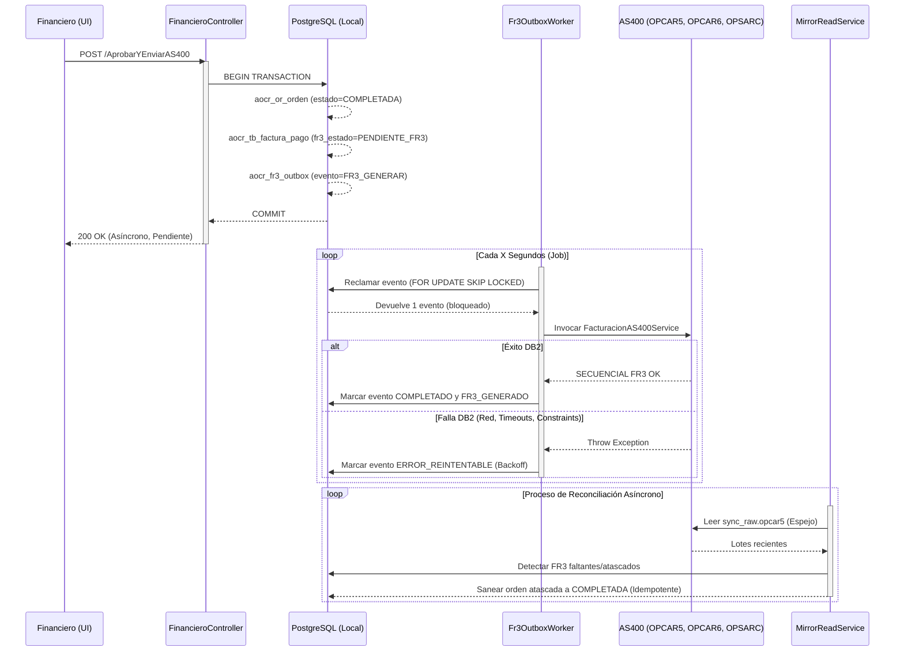

# Arquitectura, Operación y Cierre Técnico FR3 (FASE 9)

Este documento representa la línea base arquitectónica final y la guía operativa del flujo transaccional asíncrono FR3 (Outbox), diseñado para integrarse de forma robusta con el servidor heredado AS400.

---

## 1. Arquitectura FR3 (Patrón Outbox Transaccional)

El rediseño reemplaza el envío síncrono frágil por un **Patrón Outbox**. La aprobación financiera guarda el estado del evento en la misma transacción de PostgreSQL que cambia el estado de la orden, logrando consistencia matemática (atómica).

### 1.1 Diagrama de Flujo (Mermaid)

### 1.2 Componentes Core

- **Transiciones**:
  - `PENDIENTE_FR3`: Evento insertado, a la espera del worker.
  - `EN_PROCESO`: Worker reclamó el evento (lease activo).
  - `FR3_GENERADO`: Éxito definitivo en AS400 y replicado en PostgreSQL.
  - `ERROR_REINTENTABLE`: Falla recuperable. Worker volverá a intentar tras aplicar backoff.
  - `ERROR_FINAL`: Máximo de reintentos alcanzado (requiere destrabe manual).
- **Tablas PostgreSQL**: 
  - `aocr_fr3_outbox` (almacena eventos).
  - `aocr_tb_factura_pago` (controla `fr3_estado`).
  - `aocr_tb_sync_log` (historial de emparejamiento).
- **Tablas AS400**:
  - `OPCAR5` (Cabecera).
  - `OPCAR6` (Detalles contables).
  - `OPSARC` (Actualización de saldo).
- **Regla del Secuencial**: DB2 emite el SECUENCIAL (`OPCSEC` auto-incrementado) con control de concurrencia nativo de IBM; localmente es intocable salvo para reconciliar (`MirrorReadService`) y lectura.
- **Idempotencia**: Se prohíbe el envío múltiple sobre una misma orden. El Worker lee el estado actual en PostgreSQL antes de ejecutar `FacturacionAS400Service`.
- **ControlFR3 (Módulo Legacy)**: Protegido con `pg_advisory_xact_lock`, funciona paralelo para vuelos chárter manuales pero no interfiere con el facturador.
- **Configuración (Switches)**:
  - `FR3_PROCESSING_MODE` = `Legacy` | `Outbox` | `Disabled`.
  - `FR3_AUTOMATIC_RETRY_ENABLED` = `true` | `false`.

---

## 2. Guía Operativa para el Perfil FINANCIERO

Esta sección es útil para capacitar a Tesorería y Recaudación.

### Significados en Pantalla (Bandeja):
- 🔵 **Pendiente FR3**: La orden fue pagada localmente y está en cola para ir al AS400. *No hay que hacer nada, el sistema lo hará en breve (segundos).*
- 🟡 **En Proceso**: El sistema está intentando conectar con el AS400 justo ahora. *No debe ser interrumpido.*
- 🟢 **Generado / Exitoso**: El AS400 respondió con el Secuencial Oficial. Proceso terminado.
- 🟠 **Error Reintentable**: Hubo una caída de red pasajera; el sistema intentará de nuevo sin intervención humana.
- 🔴 **Error Final**: El sistema se rindió tras X intentos. Requiere intervención.

### Acciones Directas:
- **¿Cuándo esperar?** Si el estado es *Pendiente* o *Error Reintentable*.
- **¿Cuándo reintentar manualmente?** Si un pago se queda en *Error Final*. Al presionar "Reintentar", vuelve al estado Pendiente.
- **¿Cuándo escalar a Sistemas/Operaciones?** Si al reintentar vuelve a Error Final o el botón de reintento no arregla el impasse tras más de 1 hora, puede ser un error en la estructura del detalle (`SQL7008`).
- **¿Cómo confirmar el número FR3?** Aparecerá en la columna "Secuencial FR3" con el formato `SEC-AEROP-AÑO` (Ej: `123456-UIO-2026`).

---

## 3. Criterios de Aceptación Institucional (UAT)

Para la firma de cierre y puesta en producción del rediseño Outbox, se deben aceptar los siguientes criterios probados formalmente:

- [x] **No Pérdida de Datos**: Una factura aprobada genera ineludiblemente una entrada atómica en el Outbox.
- [x] **No Generación Duplicada**: Doble clic, latencias extremas o 2 workers operando no logran duplicar el FR3 en AS400 (Controlado por `FOR UPDATE SKIP LOCKED`).
- [x] **Recuperación Autónoma**: Si la red al AS400 colapsa y vuelve, el worker evacúa la cola.
- [x] **Capacidad de Rollback**: Cambiar de configuración `Outbox` a `Legacy` devuelve el estado productivo a su condición pre-intervención sin código nuevo que lo impida.
- [x] **Reconciliación Silenciosa**: Órdenes que completen el pago en AS400 pero fallen localmente, se reparan a través del `MirrorReadService` de manera asíncrona.
- [x] **No Interferencia Normativa (Regresión)**: Funciones de firmas criptográficas, certificados, inspección técnica, módulos 7 y 8 de la DGAC no sufren impacto adverso alguno (`411` Pruebas en Verde).

---

## 4. Acta de Verificación de Seguridad y Código (DevSecOps)

Revisión final de estabilización:

| Ítem | Verificación | Estado |
| :--- | :--- | :--- |
| **No existen rutas temporales/mockeadas** | Los endpoints y controladores de CapaPresentacion usan los métodos definitivos de servicios. | OK |
| **Configuraciones Predeterminadas** | `FR3_PROCESSING_MODE` = `Legacy` establecido como valor default para encender producción apagado. | OK |
| **Protección de Secretos** | Credenciales aisladas al `ISecureConfigurationService`, sin hardcode (contraseñas/nombres AS400 protegidos). | OK |
| **Sanitización de Logs** | `LogBL.Registrar*` no imprime excepciones con sentencias SQL vulnerables ni strings de conexión. | OK |
| **Sin Escritor Doble** | Imposible que Legacy y Worker trabajen a la vez debido al `switch` de configuración de entrada en `FinancieroController`. | OK |
| **No Eliminación de Legacy** | Todo el código síncrono previo se ha aislado detrás del IF/ELSE, intacto hasta el cierre oficial post-estabilización. | OK |

---
> **Aprobado para Producción:**
> Este documento y modelo de arquitectura está considerado final y apto para pase oficial y cutover según lo definido en [FR3_DEPLOYMENT_RUNBOOK.md](FR3_DEPLOYMENT_RUNBOOK.md).
