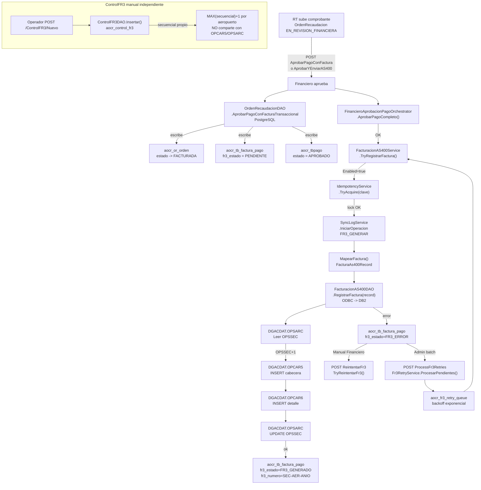

# FR3 BASELINE - Fase 0 Auditoria
**Fecha:** 2026-07-19
**Rama:** feat/flujo-institucional_v2
**SHA HEAD:** f0ca04d1
**Auditor:** Antigravity (FASE 0 - sin modificar codigo productivo)

---

## 1. Diagrama de flujo FR3



---

## 2. Tablas PostgreSQL involucradas

### 2.1 aocr_or_orden - Orden de Recaudacion
| Columna | Tipo | Descripcion |
|---|---|---|
| id | SERIAL PK | Identificador interno |
| numero_orden | VARCHAR | Numero legible |
| estado | VARCHAR | GENERADA->EN_REVISION_FINANCIERA->FACTURADA->COMPLETADA |
| codigo_usuario | INTEGER | FK usuario creador |
| total, subtotal, iva | NUMERIC | Importes |

### 2.2 aocr_tbpago - Pago
| Columna | Tipo | Descripcion |
|---|---|---|
| codigo_pago | INTEGER PK | |
| estado | VARCHAR | PENDIENTE -> APROBADO |
| numero_comprobante | VARCHAR | Referencia bancaria |
| metodo_pago | VARCHAR | TRANSFERENCIA/EFECTIVO/CHEQUE |
| banco_origen | VARCHAR | |

### 2.3 aocr_tb_factura_pago - Trazabilidad FR3 (tabla central)
| Columna | Tipo | Descripcion |
|---|---|---|
| id | SERIAL PK | |
| orden_id | INTEGER UQ | FK aocr_or_orden |
| pago_id | INTEGER UQ | FK aocr_tbpago |
| numero_factura | VARCHAR | Factura emitida |
| autorizacion_factura | VARCHAR | |
| fecha_emision | DATE | |
| subtotal, iva, total | NUMERIC | |
| file_name, file_path | VARCHAR | Ruta virtual PDF |
| creado_por | VARCHAR | Usuario financiero |
| creado_en | TIMESTAMP | |
| fr3_estado | VARCHAR | PENDIENTE / FR3_GENERADO / FR3_ERROR |
| fr3_numero | VARCHAR | Formato SEC-AEROPUERTO-ANIO (ej 2654-SEQU-2026) |
| fr3_secuencial | NUMERIC | Valor OPCSEC de AS400 |
| fr3_aeropuerto | VARCHAR | SEQU SEGU SECU |
| fr3_anio | VARCHAR | Anio del FR3 |
| fr3_error | TEXT | Mensaje de error |
| fr3_generado_en | TIMESTAMP | Cuando se genero exitosamente |
| fr3_reintentos | INTEGER | Conteo intentos fallidos |
| updated_at | TIMESTAMP | |

### 2.4 aocr_sync_log - Log operaciones AS400
| Columna | Descripcion |
|---|---|
| operacion | FR3_GENERAR FR3_RETRY etc |
| estado | PENDIENTE EN_PROCESO COMPLETADO ERROR REINTENTANDO |
| orden_id, pago_id | Referencias |
| idempotency_key | Clave unica por operacion |
| fr3_numero, fr3_secuencial | Resultado |
| intentos, max_intentos | Control reintentos |
| duracion_ms | Latencia |

### 2.5 aocr_idempotency_key - Control de duplicados
| Columna | Descripcion |
|---|---|
| clave | Hash unico FR3:{ordenId}:{numeroFactura} |
| operacion | FR3_GENERAR |
| estado | PROCESANDO / COMPLETADO / ERROR |
| fecha_expiracion | NOW() + 24h |

### 2.6 aocr_fr3_retry_queue - Cola de reintentos
| Columna | Descripcion |
|---|---|
| id | SERIAL PK |
| orden_id | FK orden |
| pago_id | FK pago |
| numero_factura, autorizacion | Datos a reintentar |
| estado | PENDIENTE/EN_PROCESO/COMPLETADO/FALLIDO/CANCELADO |
| intentos, max_intentos | Default max=5 |
| prioridad | DESC mayor primero |
| proximo_intento | Backoff (min=5*2^n max=240 min) |
| factor_backoff | 2^n |
| correlacion_id | UUID 16 chars |
| fr3_numero | Resultado exitoso |

### 2.7 aocr_control_fr3 - Control FR3 manual
| Columna | Descripcion |
|---|---|
| secuencial | NUMERIC(10,0) MAX(secuencial)+1 por aeropuerto |
| aeropuerto | VARCHAR(10) |
| anio | VARCHAR(4) |
| estado | E=Emitido P=Procesado A=Anulado G=Pagado |
| activo | BOOLEAN soft-delete |

### 2.8 Tablas AS400 DGACDAT (DB2) solo escritura desde FacturacionAS400DAO
| Tabla AS400 | Rol |
|---|---|
| DGACDAT.OPCAR5 | Cabecera FR3 en AS400 |
| DGACDAT.OPCAR6 | Lineas de detalle FR3 |
| DGACDAT.OPSARC | Secuenciales por aeropuerto/anio |

---

## 3. Secuencial FR3 - como se genera

### Flujo automatico (FacturacionAS400DAO -> AS400)
1. Fuente primaria: SELECT OPSSEC FROM DGACDAT.OPSARC WHERE OPSAER=? AND OPSANO=? -> +1
2. Fallback: SELECT COALESCE(MAX(OPCSEC), 0) FROM DGACDAT.OPCAR5 WHERE OPCAER=? AND OPCANO=? -> +1
3. Anti-duplicado: bucle hasta 10 intentos verificando que OPCSEC no exista en OPCAR5
4. Se escribe en OPCAR5 (columna OPCSEC) y se actualiza OPSARC.OPSSEC
5. Numero FR3 resultante: "{OPCSEC}-{OPCAER}-{OPCANO}" ej 2654-SEQU-2026
6. Se persiste en aocr_tb_factura_pago.fr3_numero y fr3_secuencial

### Flujo manual (ControlFR3DAO -> PostgreSQL)
- SELECT COALESCE(MAX(secuencial), 0) + 1 FROM aocr_control_fr3 WHERE aeropuerto=?
- NO comparte secuencial con OPCAR5/OPSARC - series independientes

> [!WARNING]
> Riesgo R03: ControlFR3 y el flujo automatico generan secuenciales independientes sin sincronizacion.

---

## 4. Columnas OPCAR5 utilizadas (cabecera AS400)

| Columna AS400 | Campo C# | Notas |
|---|---|---|
| OPCSEC | Secuencial | NUMERIC(10,0) generado por OPSARC |
| OPCAER | Aeropuerto | SEQU/SEGU/SECU |
| OPCANO | Anio | yyyy |
| OPCFE4 | FechaControl | yyyyMMdd |
| OPCTIP | TipoOperacion | 06 por config |
| OPCRUT | Ruta | Truncado a RutaMaxLength (default 20) |
| OPCNRO | NumAterrizaPais | sum(detalles.Cantidad) max 999 |
| OPCSUB | Subtotal | |
| OPCTOT/OPCGRA | Total | Total==GranTotal en este flujo |
| OPCSON | GranTotalLetras | Generado internamente en espaniol |
| OPCAUT | Autorizacion | substring(6, len-12) si len>12 |
| OPCOBS | Observaciones | SOL:{id}|ORD:{num}|C/PAGO:{comp}|FACT:{fact} max 250 |
| OPCNUM | NumeroFactura | DECIMAL(10,0) solo digitos max 10 chars |
| OPCCHE | Deposito | CHAR(15) comprobante o numero factura |
| OPCRU1 | Ruc | del cliente |
| OPCNO4/OPCNO5 | Compania | Nombre aerolinea |

---

## 5. Rutas HTTP y permisos

### FinancieroController [Authorize(Roles = "Financiero,CoordinadorFinanciero,Administrador")]

| Metodo | Ruta | Permiso | Descripcion |
|---|---|---|---|
| GET | /Financiero/Index | FIN_VER_PAGOS | Dashboard ordenes |
| GET | /Financiero/Dashboard | FIN_VER_PAGOS | Idem |
| POST | /Financiero/AprobarOrden | FIN_APROBAR_PAGO | Aprueba orden sin factura adjunta |
| POST | /Financiero/AprobarPago | FIN_APROBAR_PAGO | Aprueba pago especifico |
| POST | /Financiero/AprobarPagoConFactura | FIN_APROBAR_PAGO | Sube PDF registra factura llama TryRegistrarFactura |
| POST | /Financiero/AprobarYEnviarAS400 | FIN_APROBAR_PAGO | Aprueba mas envia FR3 en un solo paso |
| POST | /Financiero/ReintentarFr3 | FIN_APROBAR_PAGO | Reintento manual desde bandeja |
| POST | /Financiero/RechazarOrden | FIN_APROBAR_PAGO | Devuelve al RT |
| GET | /Financiero/HealthFinanciero | FIN_VER_PAGOS | Ping PG mas DB2 |

### ControlFR3Controller [Authorize] con sub-roles

| Metodo | Ruta | Roles | Descripcion |
|---|---|---|---|
| GET | /ControlFR3/Index | Admin Fin Op | Lista controles FR3 |
| GET | /ControlFR3/Detalles/{id} | Admin Fin Op | Detalle FR3 |
| GET | /ControlFR3/Nuevo | Admin Op | Formulario creacion |
| POST | /ControlFR3/Nuevo | Admin Op | Crea FR3 manual |
| GET | /ControlFR3/Editar/{id} | Admin Op | Formulario edicion |
| POST | /ControlFR3/Editar | Admin Op | Actualiza FR3 |
| POST | /ControlFR3/CambiarEstado | Admin Fin | JSON success message |
| POST | /ControlFR3/Eliminar | Admin | Soft-delete |
| GET | /ControlFR3/ListarJson | Admin Fin Op | DataTables AJAX |
| GET | /ControlFR3/Ping | Admin | DB ping |

### HealthController (FR3)

| Metodo | Ruta | Roles | Descripcion |
|---|---|---|---|
| GET | /Health/SyncStats | Admin Financiero | Estadisticas sync_log retry_queue |
| POST | /Health/ProcessFr3Retries | Admin | Procesa cola reintentos batch 10 |

---

## 6. Contratos JSON actuales

### AprobarYEnviarAS400 - exito
```json
{ "ok": true, "message": "Pago aprobado y enviado correctamente al AS400.", "idempotent": false, "warning": null }
```

### AprobarYEnviarAS400 - AS400 falla aprobacion PG ok
```json
{ "ok": true, "message": "El pago fue aprobado, pero ocurrio un inconveniente al enviar la informacion al AS400.", "idempotent": false, "warning": "<error>", "as400Error": true }
```

### AprobarPagoConFactura - exito
```json
{ "ok": true, "message": "Pago aprobado y factura registrada correctamente.", "idempotent": false, "warning": null }
```

### ReintentarFr3 - exito
```json
{ "ok": true, "message": "FR3 generado: 2654-SEQU-2026" }
```

### Error generico
```json
{ "ok": false, "message": "<descripcion del error>" }
```

---

## 7. Puntos de generacion o reintento de FR3 (5 identificados)

| N | Punto | Metodo invocado | Cuando |
|---|---|---|---|
| 1 | FinancieroController.AprobarPagoConFactura | FacturacionAS400Service.TryRegistrarFactura() | Al subir factura PDF y aprobar |
| 2 | FinancieroController.AprobarYEnviarAS400 | FacturacionAS400Service.TryRegistrarFactura() | Aprobacion mas envio directo |
| 3 | FinancieroController.ReintentarFr3 | FacturacionAS400Service.TryReintentarFr3() | Reintento manual desde bandeja |
| 4 | HealthController.ProcessFr3Retries | Fr3RetryService.ProcesarPendientes(10) | Procesamiento batch por admin |
| 5 | Fr3RetryService.ProcesarPendientes | Lee aocr_fr3_retry_queue con backoff | Invocado por punto 4 |

> [!IMPORTANT]
> HALLAZGO CRITICO - R01: No se encontraron llamadas a Fr3RetryService.Encolar() en NINGUN archivo de codigo productivo.
> La cola aocr_fr3_retry_queue NUNCA se puebla automaticamente al ocurrir un error FR3.
> Los errores FR3 quedan en estado FR3_ERROR y solo un admin puede procesarlos via /Health/ProcessFr3Retries.
> El encolado automatico en caso de fallo NO esta implementado.

---

## 8. Configuracion AS400:Facturacion (Web.config)

| Clave | Valor | Descripcion |
|---|---|---|
| AS400:Server | 190.152.8.185 | IP servidor AS400 |
| AS400:Database | S10a1a05 | Base de datos DB2 |
| AS400:UserId | DGACCONEXI | Usuario ODBC |
| AS400:Library | DGACDAT | Esquema/libreria |
| AS400:OdbcDriver | iSeries Access ODBC Driver | Driver ODBC |
| AS400:Facturacion:Enabled | true | FR3 habilitado |
| AS400:Facturacion:DefaultAeropuerto | SEQU | Quito |
| AS400:Facturacion:TipoOperacion | 06 | OPCAR5.OPCTIP |
| AS400:Facturacion:FormaPago | 02 | Transferencia |
| AS400:Facturacion:TipoCobro | 01 | OPCAR6 |
| AS400:Facturacion:OidFormularioNacional | 14134812 | Lineas nacionales |
| AS400:Facturacion:OidFormularioInternacional | 14134842 | Lineas internacionales |
| AS400:Facturacion:CodigoContableDefault | 623.01.11.02 | Cuenta contable |
| AS400:Facturacion:CodigoItemDefault | FITEM | |
| AS400:Facturacion:OPCAR5Table | OPCAR5 | Tabla cabecera |
| AS400:Facturacion:OPCAR6Table | OPCAR6 | Tabla detalle |
| AS400:Facturacion:OPSARCTable | OPSARC | Tabla secuenciales |
| AOCRConnection PostgreSQL | Host=172.20.16.55;Port=5432;Database=dgac_des | BD desarrollo |
| As400Odbc | VACIO EN DESARROLLO | ODBC string vacio |

> [!WARNING]
> RIESGO R06: AS400:Password = DGACTIC20@ en texto plano en Web.config. Requiere rotacion y SecureConfigurationService en produccion.

---

## 9. IsEnabled() - comportamiento

```csharp
// FacturacionAS400Service.cs linea 913
public static bool IsEnabled()
{
    var flag = GetSetting("AS400:Facturacion:Enabled", "false");
    return flag.Equals("true", StringComparison.OrdinalIgnoreCase);
}
```
- Si Enabled=false: TryRegistrarFactura() retorna true sin-op silencioso
- Si Enabled=true y ODBC vacio: lanza excepcion de conexion en ExecuteWithConnection
- Valor actual en Web.config: true

---

## 10. MirrorReadService - rol en FR3

MirrorReadService lee del mirror PostgreSQL tablas que replican AS400 (define MirrorFr3CabeceraDto con campos de OPCAR5) pero NO interviene en el flujo de generacion de FR3. Solo se usa para consulta de usuarios e inspectores. No hay llamadas desde el flujo FR3 a este servicio.

---

## 11. Estados del flujo

```
aocr_or_orden.estado:
  GENERADA -> EN_REVISION_FINANCIERA -> FACTURADA -> COMPLETADA (o PAGADA)
                                    --> DEVUELTA (si rechazada)

aocr_tbpago.estado:
  PENDIENTE -> APROBADO (o RECHAZADO)

aocr_tb_factura_pago.fr3_estado:
  (NULL) -> PENDIENTE -> FR3_GENERADO
                      -> FR3_ERROR

aocr_fr3_retry_queue.estado:
  PENDIENTE -> EN_PROCESO -> COMPLETADO
                          -> PENDIENTE (backoff)
                          -> FALLIDO (intentos >= max_intentos)
  PENDIENTE -> CANCELADO (manual admin)
```

---

## 12. Riesgos identificados

| ID | Riesgo | Severidad | Detalle |
|---|---|---|---|
| R01 | Fr3RetryService.Encolar() sin callers | ALTO | Cola existe pero no se puebla automaticamente en errores FR3 |
| R02 | ODBC vacio en dev | MEDIO | As400Odbc vacIO: llamadas fallaran si Enabled=true |
| R03 | Secuenciales independientes | MEDIO | ControlFR3 PG vs OPSARC AS400 sin sincronizacion |
| R04 | Lock EXCLUSIVE en OPCAR5 | MEDIO | Se ignora silenciosamente; fallback sin transaccion ante SQL7008 |
| R05 | Idempotency key expira 24h | MEDIO | Reintentos tras 24h pueden duplicar FR3 en AS400 |
| R06 | Credenciales AS400 texto plano | ALTO | Password visible en Web.config |
| R07 | UQ orden_id en aocr_tb_factura_pago | MEDIO | Solo 1 factura por orden; INSERT ON CONFLICT sobrescribe datos |
| R08 | Numero FR3 como string SEC-AER-ANIO | BAJO | Formato informativo; cambio romperia idempotencia por OPCOBS |

---

## 13. Archivos inspeccionados

| Archivo | Tamano | Observacion |
|---|---|---|
| CapaPresentacion/Controllers/FinancieroController.cs | 57 KB 1281 lineas | Controlador principal FR3 |
| CapaPresentacion/Controllers/ControlFR3Controller.cs | 18 KB 504 lineas | Flujo manual FR3 |
| CapaNegocio/Services/FacturacionAS400Service.cs | 39 KB 926 lineas | Servicio principal FR3 |
| CapaNegocio/Services/Fr3RetryService.cs | 19 KB 480 lineas | Servicio cola reintentos |
| CapaDatos/DAOs/FacturacionAS400DAO.cs | 69 KB 1766 lineas | DAO ODBC DB2 |
| CapaDatos/DAOs/OrdenRecaudacionDAO.cs | 232 KB 5151 lineas | DAO PostgreSQL incl RegistrarResultadoFr3 |
| CapaDatos/DAOs/ControlFR3DAO.cs | 49 KB 1082 lineas | DAO manual FR3 PostgreSQL |
| CapaNegocio/Integraciones/As400Sync/MirrorReadService.cs | 48 KB 1040 lineas | Mirror (no interviene en FR3) |
| CapaPresentacion/Controllers/HealthController.cs | 20 KB 546 lineas | Endpoints admin FR3 |
| CapaPresentacion/Web.config | - | Configuracion AS400 |
| scripts/create_tables_fr3.sql | 5.8 KB | DDL tablas FR3 PostgreSQL |
| scripts/20260601_sync_audit_idempotency.sql | 14 KB | DDL sync_log idempotency_key |

---

## 14. Tests FR3 existentes

### Tests unitarios
| Archivo | Cobertura FR3 |
|---|---|
| AOCR.Tests/Unit/FinancialOrderStateHelperTests.cs | Estados financieros fr3_estado como input de vista |
| AOCR.Tests/Unit/OrdenRecaudacionOrchestratorTests.cs | Orquestador aprobacion |

### Tests de integracion
| Archivo | Cobertura FR3 |
|---|---|
| AOCR.Tests/Integration/FinancieroAprobacionPagoIntegrationTest.cs | Aprobacion completa contra PostgreSQL dev sin AS400 |

**NO existen tests de caracterizacion para FacturacionAS400DAO, FacturacionAS400Service ni Fr3RetryService.**
La cobertura de codigo AS400 es CERO por falta de acceso a DB2.

---

## 15. Resultado de compilacion

**MSBuild:** C:\Program Files\Microsoft Visual Studio\2022\Community\MSBuild\Current\Bin\MSBuild.exe
**Configuracion:** Debug / Any CPU
**Resultado:** BUILD EXITOSO

Proyectos compilados:
- AOCR -> AOCR\bin\AOCR.dll
- CapaModelo -> CapaModelo\bin\Debug\CapaModelo.dll
- CapaUtilidades -> ClassLibrary1\bin\Debug\ClassLibrary1.dll
- CapaDatos -> CapaDatos\bin\Debug\CapaDatos.dll
- CapaNegocio -> CapaNegocio\bin\Debug\CapaNegocio.dll
- CapaPresentacion -> CapaPresentacion\bin\CapaPresentacion.dll
- AOCR.Tests -> AOCR.Tests\bin\Debug\AOCR.Tests.dll

Warning (no error): itext.commons Version 9.5.0.0 tiene dependencias en .NET Framework posterior al target.
No se ejecutaron tests automatizados (requieren conexion a PostgreSQL 172.20.16.55 - entorno dev).

---

## 16. Limitaciones de acceso AS400

- NO se realizo ninguna conexion a AS400 productivo (cumpliendo regla 5)
- La connection string As400Odbc esta VACIA en el entorno de desarrollo
- No se pudo verificar el estado de OPCAR5 OPCAR6 OPSARC en DB2
- El driver iSeries Access ODBC Driver debe estar instalado en el servidor
- Imposible verificar si OPSARC tiene datos o si el secuencial actual en AS400 esta sincronizado

---

## 17. Cambios realizados en esta Fase 0

| Tipo | Archivo | Detalle |
|---|---|---|
| Documentacion | docs/FR3_BASELINE.md | Este archivo - solo lectura sin modificar codigo |

**NO se modifico ningun archivo de codigo productivo, base de datos ni configuracion.**
Los 5 archivos con cambios locales del usuario se conservaron intactos:
- CapaPresentacion/Properties/PublishProfiles/FolderProfile5.pubxml.user
- public/Scripts/firma-aocr.js
- public/Views/FirmaAocr/Index.cshtml
- public/Views/Inspeccion/PendientesEmisionAocr.cshtml
- public/Views/Inspeccion/RedactarEspecificaciones.cshtml

---

## 18. Commit sugerido

```
test(fr3): characterize current financial and AS400 flow

- Audit FR3 flow: FinancieroController, FacturacionAS400Service,
  FacturacionAS400DAO, Fr3RetryService, ControlFR3Controller/DAO,
  OrdenRecaudacionDAO (RegistrarResultadoFr3), MirrorReadService
- Document PostgreSQL tables: aocr_tb_factura_pago, aocr_sync_log,
  aocr_idempotency_key, aocr_fr3_retry_queue, aocr_control_fr3
- Document AS400 tables: OPCAR5, OPCAR6, OPSARC (DGACDAT schema)
- Document HTTP contracts, permissions and JSON responses
- Identify risk R01: Fr3RetryService.Encolar() has no callers
- Identify risk R06: AS400 credentials in plaintext Web.config
- Build result: SUCCESS (Debug, 7 projects, 1 warning iText9)
- No AS400 productive environment accessed
- No code, DB or config modified
```
