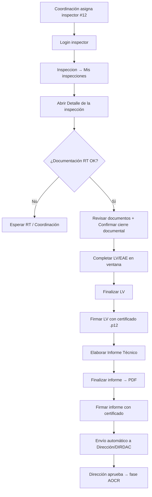

# Guía operativa — Inspector asignado · Solicitud #12

**Referencia:** `DGAC-GOP-2026-AOCR012` (código interno **#12**)  
**Rol:** Inspector técnico asignado por coordinación  
**Alcance:** desde la asignación hasta firma del Informe Técnico (fases posteriores: Dirección / Coordinación / DIRDAC)

**Referencia cruzada:** flujo completo RT→AOCR en [MANUAL_FLUJO_RT_A_AOCR.md](MANUAL_FLUJO_RT_A_AOCR.md) · capturas [GUIA_VISUAL_FLUJO_RT_AOCR.md](GUIA_VISUAL_FLUJO_RT_AOCR.md)

---

## Diagrama del flujo (inspector)



---

## Fase 0 — Pre-requisito (Coordinación, no inspector)

Antes de que el inspector trabaje, debe cumplirse:

| Requisito | Quién | Cómo verificar |
|-----------|--------|----------------|
| Inspector asignado a #12 | **GEN_COORDINACION** | `Tecnico/Index` → Asignar inspector → en detalle solicitud ya no dice “Sin asignar” |
| Documentación habilitante cargada | RT | `SolicitudAOCR/Detalle/12` → documentos vigentes |
| Aceptación documental (si aplica) | Coordinación | Estado ≠ bloqueado por observaciones pendientes |

Si el inspector entra y ve el mensaje *“No se puede iniciar la inspección porque la fase documental aún no ha sido finalizada”*, **no avanza** hasta que coordinación/RT resuelvan la documentación.

---

## Fase 1 — Acceso e ingreso

### 1.1 Login

- Ingresar con la **cuenta del inspector asignado** (rol `Inspector`).
- Seleccionar compañía activa si el sistema lo solicita.

### 1.2 Ir a la inspección de #12

**Menú lateral → Inspecciones → Mis inspecciones**  
Ruta: `Inspeccion/Index`

Buscar la fila vinculada a `DGAC-GOP-2026-AOCR012` o solicitud **#12**.

**URLs útiles:**

| Destino | Ruta exacta (solicitud #12) |
|---------|----------------------------|
| Bandeja inspector | `/Inspeccion/Index` |
| Detalle inspección | `/Inspeccion/Detalle/11` |
| Revisión documental (acción) | `/Documento/Lista?solicitudId=12&modo=revision&origen=revision-documental` |
| Revisión documental (consulta) | `/Documento/Lista?solicitudId=12&modo=ver` — **no decidir aquí** |
| Bandeja revisión | `/RevisionDocumental/Index` |
| Detalle solicitud | `/SolicitudAOCR/Detalle/12` |

---

## Fase 2 — Revisión documental (obligatoria)

> Las revisiones del coordinador (usuario 45, observación COO-1 en BD) **no** cuentan como decisión del inspector. Código: `FiltrarDetallesRevisionPorInspector` en `SolicitudAocrInfraBL.cs`.

### 2.1 Entrada correcta

| No usar | Usar |
|---------|------|
| `/Documento/Lista?solicitudId=12&modo=ver` (badge **Solo lectura**) | `/Documento/Lista?solicitudId=12&modo=revision&origen=revision-documental` |
| Título *Archivos del expediente* | Título *Bandeja de revisión documental* |

**Ruta recomendada:** `/RevisionDocumental/Index` → botón **Revisar documentación** en fila solicitud #12.

### 2.2 Decisión por documento

Antes de actuar, cada fila debe mostrar **PENDIENTE**, observación vacía, revisor vacío.

- **Aceptar:** `POST Documento/AceptarDocumentoSolicitud`
- **Devolver:** `POST Documento/DevolverDocumentoSolicitud` (motivo ≥ 10 caracteres)

Tras aceptar: revisor = nombre inspector **43**, no GERMAN ALBERTO (45).

### 2.3 Confirmar cierre documental

Cuando **todos** los documentos tengan decisión del inspector:

1. `/Inspeccion/Detalle/11`
2. Clic **Confirmar cierre documental**
3. `POST Inspeccion/ConfirmarRevisionDocumentalInspector/11`
4. Confirmación válida si `estado_documental` = `EN_REVISION` o comentario contiene *Inspector confirmó revisión documental* (`RevisionDocumentalService.InspectorConfirmoCierreDocumental`)

**Si LV sigue bloqueada:** falta aceptar algún documento o no se confirmó cierre — mensaje UI: *"...confirme el cierre documental antes de habilitar la LV/EAE..."*

---

## Fase 3 — Lista de Verificación LV/EAE

Sección **“Flujo técnico operativo → Lista de verificación operacional (LV)”**.

### 3.1 Abrir ventana LV

- Clic en **“Completar LV en ventana”** (modal dedicado).

### 3.2 Completar criterios

En el modal:

1. Marcar cumplimiento/implementación de cada ítem.
2. Completar comentarios donde aplique.
3. **Guardar** (borrador) — botón outline azul.

**Acción backend:** `POST Inspeccion/GuardarListaVerificacionOperacionalEae`

### 3.3 Finalizar LV

- Clic en **“Finalizar LV”** → genera PDF de la lista.
- Estado esperado: **“LV completada”**.

**Acción backend:** `POST Inspeccion/FinalizarListaVerificacionOperacionalEae`

### 3.4 Firmar LV (certificado digital)

- Cargar certificado **`.p12` / `.pfx`** institucional o personal.
- Ingresar contraseña del certificado.
- Clic en **“Firmar Lista de Verificación LV”**.
- Estado esperado: **“LV firmada”**.

**Acción backend:** `POST Inspeccion/FirmarListaVerificacionOperacionalEae`

> Sin LV **finalizada y firmada**, el botón **Informe Técnico** permanece bloqueado con candado.

---

## Fase 4 — Informe Técnico

### 4.1 Abrir editor

En el bloque **“Flujo técnico operativo”**:

- Clic en **“Informe Técnico”** (modal dedicado).

Campos típicos:

- Datos de la inspección / operador.
- **Resultado:** Satisfactorio o No satisfactorio.
- Si es **No satisfactorio:** registrar hallazgos u observaciones (obligatorio).
- Conclusiones y anexos si aplica.

**Acción backend:** `GET Inspeccion/ModalInformeTecnico`

### 4.2 Guardar borrador

- Guardar desde el modal.
- Puede iterar hasta que el contenido esté completo.

**Acción backend:** `POST Inspeccion/GuardarInformeTecnico`

### 4.3 Finalizar informe

En el panel de firma del inspector:

- Clic en **“Finalizar informe”** → genera PDF consolidado.
- Mensaje esperado: *“Informe técnico finalizado y PDF generado. Ya puede firmar como inspector.”*

**Acción backend:** `POST Inspeccion/FinalizarInformeTecnico`

### 4.4 Firmar informe (certificado digital)

1. Cargar certificado **`.p12` / `.pfx`**.
2. Contraseña del certificado.
3. Clic en **“Firmar informe”**.

Tras firmar:

- Estado: **FIRMADO_INSPECTOR**.
- El sistema **envía automáticamente a Dirección/DIRDAC** para revisión institucional.
- El inspector **no genera la AOCR** en esta etapa.

**Acción backend:** `POST Inspeccion/FirmarInformeInspector`

---

## Fase 5 — Qué ocurre después (otros roles)

| Paso | Rol | Acción |
|------|-----|--------|
| Revisión / aprobación informe | **Dirección / DIRDAC** | `Inspeccion/PendientesDireccion` → Aprobar o Devolver |
| Habilitación fase AOCR | Sistema | Al aprobar informe → solicitud pasa a **AOCR En Elaboración** |
| Generar AOCR / Condiciones | **Coordinación / Legal** | `CoordinacionJefatura/ValidarAocr` o flujo AOCR en detalle solicitud |
| Firma final DIRDAC | **DIRDAC** | Firmas pendientes en bandeja dirección |
| Documentos finales | RT / todos | Descarga AOCR + condiciones firmadas |

El inspector solo interviene de nuevo si **Dirección devuelve** el informe (aparece observación de devolución en el panel).

---

## Checklist rápido — Solicitud #12

| # | Acción | Estado esperado |
|---|--------|-----------------|
| ☐ | Coordinación asignó inspector (`GEN_COORDINACION`) | Detalle #12 muestra nombre inspector |
| ☐ | Inspector abre `Inspeccion/Detalle` | Sin error 403 |
| ☐ | Confirmar cierre documental | LV deja de estar bloqueada |
| ☐ | LV guardada → finalizada → firmada | Badge “LV firmada” |
| ☐ | Informe guardado → finalizado → firmado | “Informe firmado digitalmente” |
| ☐ | Informe enviado a Dirección | Estado `ENVIADO_A_DIRDAC` |

---

## Errores frecuentes y solución

| Síntoma | Causa probable | Qué hacer |
|---------|----------------|-----------|
| Botones LV/Informe con candado | Revisión documental no confirmada | Confirmar cierre documental |
| “Debe firmar la LV antes del informe” | LV no finalizada/firmada | Completar pasos 3.3 y 3.4 |
| HTTP 403 al guardar informe/LV | Usuario no es el inspector asignado | Verificar asignación en coordinación |
| “fase documental no finalizada” | RT/coordinación pendientes | Escalar a GEN_COORDINACION |
| Firma falla | Certificado vencido o contraseña incorrecta | Validar `.p12` en entorno de prueba |
| Informe bloqueado tras firmar | Flujo normal — espera Dirección | Revisar `PendientesDireccion` (rol dirección) |

**Log a revisar** (servidor):

```
[GestionInspeccion]
[AUTH] Acceso bloqueado
```

Archivo: `CapaPresentacion/App_Data/Logs/AOCR_YYYYMMDD.log`

---

## Materiales que debe tener el inspector

1. **Certificado digital** `.p12` o `.pfx` vigente (para LV e Informe).
2. **Contraseña** del certificado (no se almacena en el sistema).
3. Acceso de red al entorno publicado.

---

## Orden estricto (regla de negocio en backend)

```
Revisión documental confirmada
    → LV finalizada
    → LV firmada
    → Informe elaborado
    → Informe finalizado (PDF)
    → Informe firmado por inspector
    → Revisión Dirección
    → AOCR (coordinación/legal)
```

Saltarse un paso devuelve **403** o botón deshabilitado — comportamiento esperado tras las validaciones en `AocrAuthorizationService` y `AocrFlujoValidacionService`.

---

## Referencias técnicas

| Documento | Contenido |
|-----------|-----------|
| `docs/AOCR_FLUJO_INTEGRAL_MATRICES.md` | Matrices de estados, roles y fases del plan maestro |
| `docs/GUIA_PRUEBAS_POST_REPUBLICACION.md` | Pruebas manuales post-republicación (firma coord., nuevo aeropuerto, `/Tecnico`) |
| `CapaPresentacion/Views/Inspeccion/Detalle.cshtml` | Visibilidad de botones LV/Informe |
| `CapaNegocio/Services/AocrFlujoValidacionService.cs` | Validaciones LV → Informe → AOCR |

---

*Última actualización: 2026-06-11*
