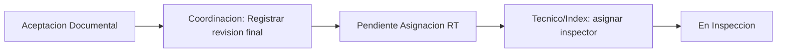
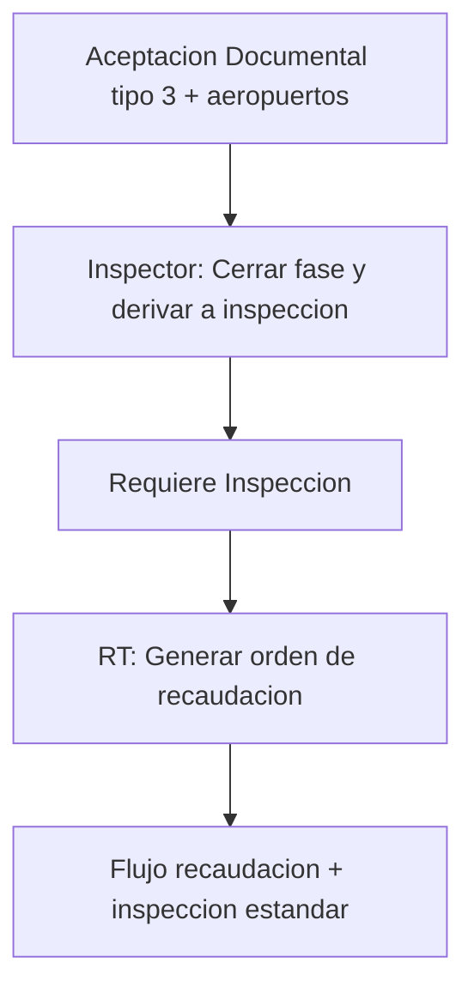

# Guía de pruebas manuales — Post-republicación (2026-06-11)

**Entorno:** `C:\AOCR\publicacion1`  
**Alcance:** validar correcciones de coherencia del flujo integral (firma coordinador, rama nuevo aeropuerto, fix visual `/Tecnico`).

**Documentos relacionados:**

| Documento | Uso |
|-----------|-----|
| `docs/AOCR_FLUJO_INTEGRAL_MATRICES.md` | Matrices de estados y §11 correcciones |
| `docs/GUIA_INSPECTOR_SOLICITUD_12.md` | Continuación inspector tras asignación (#12) |

---

## 0. Antes de empezar

### 0.1 Republicación

Confirmar que estos archivos tienen fecha reciente en `publicacion1`:

- `bin\CapaDatos.dll`, `CapaNegocio.dll`, `CapaPresentacion.dll`
- `Content\aocr-contrast.css`, `aocr-datatables.css`
- `Views\SolicitudAOCR\Detalle.cshtml`, `Views\Tecnico\Index.cshtml`

### 0.2 Reciclar aplicación

Si el sitio corre en IIS:

1. Reciclar el **Application Pool** del sitio que apunta a `publicacion1`.
2. O reiniciar IIS (`iisreset`) en el servidor donde está publicado.

### 0.3 Navegador

- Abrir la URL del entorno publicado.
- **Ctrl + F5** (recarga forzada) en cada pantalla probada.
- Usar ventana de incógnito si persiste CSS antiguo.

### 0.4 Cuentas habituales

| Rol | Usuario de referencia | Rutas clave |
|-----|----------------------|-------------|
| Coordinación | `GEN_COORDINACION` | `/Tecnico`, `/SolicitudAOCR/Detalle/{id}` |
| RT / Solicitante | Propietario de la solicitud | `/SolicitudAOCR/Detalle/{id}`, `/OrdenRecaudacion/Nueva` |
| Inspector | Inspector asignado | `/Inspeccion/Index`, `/SolicitudAOCR/Detalle/{id}` |

### 0.5 Qué verificar siempre

En el detalle de solicitud, el **estado visible** debe coincidir con la tabla de cada escenario.  
Log del servidor: `publicacion1\App_Data\Logs\AOCR_YYYYMMDD.log`

---

## Escenario A — Fix visual en `/Tecnico`

**Objetivo:** confirmar que desapareció el texto con resaltado azul permanente (`#0d6efd`).

| Paso | Acción | Resultado esperado |
|------|--------|-------------------|
| A1 | Login como **GEN_COORDINACION** | Acceso sin error |
| A2 | Ir a **Gestión de asignaciones** → `/Tecnico` o `/Tecnico/Index` | Tabla de solicitudes visible |
| A3 | Revisar filas, encabezados, badges y paginación | **Ningún** texto con fondo/selección azul fija |
| A4 | Seleccionar texto con el mouse y soltar | El resaltado de selección desaparece al deseleccionar |

**Si falla:** verificar en DevTools (F12 → Network) que cargan `aocr-contrast.css` y `aocr-datatables.css` con código 200 y fecha reciente.

---

## Escenario B — Emisión/renovación: firma coordinador → asignación RT

**Referencia:** solicitud **#12** — `DGAC-GOP-2026-AOCR012`  
**Tipo esperado:** emisión (1) o renovación (2). Si #12 es modificación (3), usar el **Escenario C** o otra solicitud tipo 1/2.

### Diagrama



### B1 — Llevar #12 a aceptación documental (si aún no está)

| Paso | Rol | Acción |
|------|-----|--------|
| B1.1 | RT | Cargar documentación obligatoria en `/SolicitudAOCR/Detalle/12` |
| B1.2 | Inspector | Revisar y aceptar documentos (revisión documental) |
| B1.3 | Coordinación | Confirmar que el estado sea **`Aceptacion Documental`** |

**URL:** `/SolicitudAOCR/Detalle/12`

### B2 — Firma / revisión final de coordinación

| Paso | Rol | Acción | Resultado esperado |
|------|-----|--------|-------------------|
| B2.1 | **GEN_COORDINACION** | Abrir `/SolicitudAOCR/Detalle/12` | Panel **“Revision final de Coordinacion”** visible |
| B2.2 | Coordinación | Clic **“Registrar revision final”** | Mensaje: *“…pendiente de asignación de inspector en la bandeja de coordinación.”* |
| B2.3 | — | Revisar estado en detalle | **`Pendiente Asignacion RT`** (no `Firmado Coordinador`, no `Finalizado`) |

**Acción backend:** `POST SolicitudAOCR/FirmarAceptacionDocumental`

### B3 — Descarga de constancia (regresión)

| Paso | Rol | Acción | Resultado esperado |
|------|-----|--------|-------------------|
| B3.1 | RT o Coordinación | **Descargar constancia** de aceptación documental | PDF descargado |
| B3.2 | — | Revisar estado tras descarga | Sigue en **`Pendiente Asignacion RT`** — **no** pasa a `Finalizado` |

### B4 — Bandeja y asignación

| Paso | Rol | Acción | Resultado esperado |
|------|-----|--------|-------------------|
| B4.1 | **GEN_COORDINACION** | Ir a `/Tecnico/Index` | Solicitud #12 aparece en bandeja |
| B4.2 | Coordinación | Contador sidebar ≈ filas de bandeja | Coherencia contador/bandeja |
| B4.3 | Coordinación | **Asignar inspector** a #12 | Asignación exitosa (sin error por orden ANULADA) |
| B4.4 | — | Estado en detalle | **`En Inspeccion`** o equivalente operativo |

### B5 — Continuación inspector

Seguir **`docs/GUIA_INSPECTOR_SOLICITUD_12.md`** desde Fase 1 (login inspector → LV → Informe).

---

## Escenario C — Modificación tipo 3 con nuevo aeropuerto

**Objetivo:** validar la rama institucional cuando `AeropuertosEcuador` (o `AeropuertosEcuadorOtros`) no está vacío.

> Si no existe una solicitud tipo 3 con aeropuertos declarados, crear una nueva modificación desde el menú RT (**Modificación de Condiciones y Limitaciones**, `tipoSolicitud=3`) e indicar al menos un aeropuerto en el formulario.

### Diagrama



### C1 — Preparar solicitud modificación

| Paso | Rol | Acción | Resultado esperado |
|------|-----|--------|-------------------|
| C1.1 | RT | Crear o abrir solicitud **tipo 3** con aeropuertos declarados | Campo aeropuertos con valor (ej. `SEQM`) |
| C1.2 | RT + Inspector + Coord. | Completar documentación hasta **`Aceptacion Documental`** | Estado correcto |

**URL ejemplo:** `/SolicitudAOCR/Detalle/{id}`

### C2 — Panel inspector (rama nuevo aeropuerto)

| Paso | Rol | Acción | Resultado esperado |
|------|-----|--------|-------------------|
| C2.1 | **Inspector** | Abrir detalle de la solicitud modificación | Panel **“Resolucion de modificacion”** |
| C2.2 | — | Revisar botones disponibles | **Solo** “Cerrar fase y derivar a inspeccion” |
| C2.3 | — | Confirmar ausencia | **No** deben aparecer “No requiere nueva inspeccion” ni “Derivar a inspeccion” genérico |
| C2.4 | Inspector | Completar observación y enviar cierre | Mensaje de éxito del servicio |
| C2.5 | — | Estado | **`Requiere Inspeccion`** |

**Acción backend:** `POST SolicitudAOCR/CerrarFaseDocumentalNuevoAeropuertoModificacion`

### C3 — Panel RT (orden de recaudación)

| Paso | Rol | Acción | Resultado esperado |
|------|-----|--------|-------------------|
| C3.1 | **RT** (propietario) | Abrir detalle de la misma solicitud | Panel **“Solicitar inspeccion del nuevo aeropuerto”** |
| C3.2 | RT | Clic **“Generar orden de recaudacion”** | Redirige a `/OrdenRecaudacion/Nueva` |
| C3.3 | RT | Completar orden con concepto de inspección | Orden creada; flujo continúa según recaudación |

### C4 — Bloqueos de regresión (opcional)

Intentar desde backend/UI lo siguiente **en una solicitud con aeropuertos declarados** — debe **rechazarse**:

| Intento | Resultado esperado |
|---------|-------------------|
| `GenerarCondicionesLimitacionesModificacion` | Error: modificación con nuevo aeropuerto no puede cerrar con CL directas |
| `MarcarRequiereInspeccionModificacion` (genérico) | Error: debe usar cierre institucional de fase documental |

---

## Escenario D — Modificación tipo 3 **sin** nuevo aeropuerto (control)

**Objetivo:** confirmar que la rama clásica sigue operativa.

| Paso | Condición | Botones esperados en “Resolucion de modificacion” |
|------|-----------|---------------------------------------------------|
| D1 | Tipo 3, `AeropuertosEcuador` vacío, estado `Aceptacion Documental` | **“No requiere nueva inspeccion”** y **“Derivar a inspeccion”** |
| D2 | Clic “No requiere nueva inspeccion” | Estado → `Generado Condiciones Limitaciones` |
| D3 | O clic “Derivar a inspeccion” | Estado → `Requiere Inspeccion` (vía flujo estándico, sin panel RT especial de nuevo aeropuerto) |

---

## Checklist consolidado

| # | Escenario | ☐ OK | Evidencia / notas |
|---|-----------|------|-------------------|
| 1 | A — Sin texto fantasma en `/Tecnico` | ☐ | |
| 2 | B2 — Firma coord. #12 → `Pendiente Asignacion RT` | ☐ | |
| 3 | B3 — Descarga constancia no cierra en `Finalizado` | ☐ | |
| 4 | B4 — #12 en bandeja + asignación inspector | ☐ | |
| 5 | B5 — Inspector continúa LV/Informe (guía #12) | ☐ | |
| 6 | C2 — Mod. con aeropuertos: solo cierre institucional | ☐ | ID solicitud: _____ |
| 7 | C3 — RT ve panel orden recaudación | ☐ | |
| 8 | D — Mod. sin aeropuertos: ramas CL / inspección | ☐ | ID solicitud: _____ |

---

## Errores frecuentes

| Síntoma | Causa probable | Solución |
|---------|----------------|----------|
| Cambios no visibles | DLL/CSS en caché o app pool sin reciclar | Ctrl+F5 + reciclar pool |
| Estado sigue `Firmado Coordinador` tras firma emisión | DLL antigua en `bin` | Verificar timestamp de `CapaNegocio.dll` |
| Descarga cierra en `Finalizado` | `CapaPresentacion.dll` antigua | Republicar y reciclar |
| Panel modificación muestra botones incorrectos | Solicitud sin aeropuertos declarados o tipo ≠ 3 | Verificar `TipoSolicitud` y `AeropuertosEcuador` |
| RT no ve panel orden recaudación | Usuario no es propietario o estado ≠ `Requiere Inspeccion` | Login como RT dueño de la solicitud |
| Asignación falla en #12 | Estado no es `Pendiente Asignacion RT` | Repetir B2 o revisar log |

---

## Consulta rápida de estado (SQL opcional)

Si tiene acceso a la base de datos del entorno de prueba:

```sql
SELECT codigo_solicitud,
       numero_tramite,
       tipo_solicitud,
       estado,
       aeropuertos_ecuador
FROM   aocr_tbsolicitud
WHERE  codigo_solicitud IN (12 /* #12 */, /* id modificación */ )
ORDER  BY codigo_solicitud;
```

**Valores de referencia:**

| tipo_solicitud | Tras firma coordinador |
|----------------|------------------------|
| 1 Emisión | `Pendiente Asignacion RT` |
| 2 Renovación | `Pendiente Asignacion RT` |
| 3 Modificación | `Firmado Coordinador` → resolución inspector |

---

*Última actualización: 2026-06-11 — republicación en `C:\AOCR\publicacion1`*
