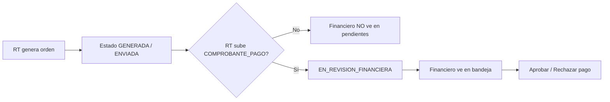

# Guía de pruebas — Sidebar, Financiero y Compañía activa RT

**Versión:** 2026-06-13  
**Entorno:** `C:\AOCR\publicacion1`  
**Alcance:** validar republicación con acordeón sidebar, flujo financiero (comprobante antes de bandeja) y compañía activa RT multi-compañía.

---

## 0. Pre-requisitos

### 0.1 Archivos publicados

Confirmar fecha reciente en destino:

| Archivo | Qué valida |
|---------|------------|
| `bin\CapaPresentacion.dll` | Controllers, vistas, sidebar |
| `bin\CapaNegocio.dll` | `FinancialOrderStateHelper`, `AocrCompaniaContextService` |
| `bin\CapaDatos.dll` | `compania_codigo` en órdenes |
| `Content\aocr-sidebar.css` | Acordeón inline |
| `Scripts\aocr-sidebar.js` | Despliegue submenús |
| `Views\Shared\_Sidebar.cshtml` | HTML acordeón |

### 0.2 IIS y navegador

1. Reciclar **Application Pool** del sitio que apunta a `publicacion1`.
2. Abrir URL del entorno en **ventana incógnito**.
3. **Ctrl + F5** en cada pantalla probada.

### 0.3 Migración SQL (compañía en órdenes)

Si aún no se aplicó, ejecutar en `dgac_des`:

```
scripts\db\20260611_add_compania_codigo_aocr_or_orden.sql
```

Verificar columna:

```sql
SELECT column_name FROM information_schema.columns
WHERE table_name = 'aocr_or_orden' AND column_name = 'compania_codigo';
```

### 0.4 Cuentas de prueba

| Rol | Usuario | id |
|-----|---------|-----|
| RT | `GACAJAS` | 45 |
| Inspector | `1709565459` | 43 |
| Coordinación | `GEN_COORDINACION` | 49 |
| Financiero | `GEN_FINANCIERO` | 48 |

### 0.5 Log

Errores y trazas: `publicacion1\App_Data\Logs\AOCR_YYYYMMDD.log`

---

## Escenario 1 — Sidebar acordeón (todos los roles)

**Objetivo:** submenús inline, sin panel flotante cortado ni `<template>`.

| # | Acción | Resultado esperado |
|---|--------|-------------------|
| 1.1 | Login con cualquier rol (ej. `GEN_COORDINACION`) | Sidebar visible a la izquierda |
| 1.2 | Clic en un ítem con submenú (ej. **Operaciones**, **Financiero**) | Submenú se **despliega inline** debajo del ítem |
| 1.3 | Clic en otro ítem con submenú | El anterior se cierra; el nuevo se abre |
| 1.4 | Redimensionar ventana a ancho móvil (~375px) | Sidebar se oculta; botón hamburguesa lo abre con **backdrop** oscuro |
| 1.5 | Clic en backdrop o enlace del submenú (móvil) | Sidebar se cierra |
| 1.6 | F12 → Elements | **No** existe `#aocrSubnavPanel` activo; submenús son `<ul class="aocr-submenu">` dentro del sidebar |
| 1.7 | Abrir un modal (ej. confirmación en detalle solicitud) | Modal **por encima** del sidebar (z-index correcto) |

**Si falla:** verificar en Network que cargan `aocr-sidebar.css` y `aocr-sidebar.js` con HTTP 200 y fecha reciente.

---

## Escenario 2 — Compañía activa RT (multi-compañía)

**Objetivo:** Nueva Orden y datos RT usan la compañía seleccionada en sidebar, no la primera ni `EmpresaCodigo` por defecto.

**Precondición:** usuario RT con **2 o más** compañías asignadas (ej. `GACAJAS`).

| # | Acción | Resultado esperado |
|---|--------|-------------------|
| 2.1 | Login como `GACAJAS` | Si hay varias compañías, selector de compañía visible en sidebar |
| 2.2 | Anotar compañía A actual en sidebar | Nombre/código visible |
| 2.3 | Ir a **Orden de recaudación → Nueva** (`/OrdenRecaudacion/Nueva`) | Alerta/banner muestra **misma compañía A** |
| 2.4 | Revisar campos RUC / razón social precargados | Corresponden a compañía **A** |
| 2.5 | Volver al sidebar; cambiar a compañía **B** (`Account/CambiarCompaniaActiva`) | Mensaje de éxito; sidebar muestra compañía B |
| 2.6 | Ir de nuevo a `/OrdenRecaudacion/Nueva` | Banner y datos precargados = compañía **B** |
| 2.7 | Guardar borrador o generar orden | Orden creada con `compania_codigo` = B (ver detalle o BD) |
| 2.8 | Cambiar a compañía A; crear otra orden | `compania_codigo` = A |

**Regresión — RT con una sola compañía:**

| # | Acción | Resultado esperado |
|---|--------|-------------------|
| 2.9 | Login RT con **una** compañía | Se auto-selecciona; no pide elegir |
| 2.10 | Nueva Orden | Compañía única coherente en formulario |

**Verificación BD (opcional):**

```sql
SELECT id, numero_orden, compania_codigo, fecha_creacion
FROM aocr_or_orden
ORDER BY id DESC
LIMIT 5;
```

---

## Escenario 3 — Flujo financiero (comprobante antes de bandeja)

**Objetivo:** Financiero **no** ve órdenes hasta que RT sube comprobante; contador sidebar coherente con bandeja.

### Diagrama



### 3A — Orden nueva sin comprobante

| # | Rol | Acción | Resultado esperado |
|---|-----|--------|-------------------|
| 3.1 | RT | Generar orden de recaudación (sin subir comprobante) | Orden en estado operativo inicial (GENERADA/ENVIADA) |
| 3.2 | RT | **No** subir comprobante aún | — |
| 3.3 | Financiero (`GEN_FINANCIERO`) | Ir a `/Financiero/Index` (sidebar: **Pagos pendientes**) | Filtro por defecto = **PENDIENTES_FINANCIERO** |
| 3.4 | Financiero | Buscar la orden recién creada | **No aparece** en la lista |
| 3.5 | Financiero | Revisar badge del sidebar (Pagos pendientes) | Contador **no** incluye esa orden |
| 3.6 | Financiero | Cambiar filtro a **Todas** (si existe) | Orden puede aparecer, pero **sin** acciones de aprobar/rechazar pago |

### 3B — RT sube comprobante

| # | Rol | Acción | Resultado esperado |
|---|-----|--------|-------------------|
| 3.7 | RT | Subir documento tipo **COMPROBANTE_PAGO** en la orden | Carga exitosa |
| 3.8 | — | Revisar estado orden | Pasa a **EN_REVISION_FINANCIERA** (o equivalente operativo) |
| 3.9 | Financiero | Refrescar `/Financiero/Index?estado=PENDIENTES_FINANCIERO` | Orden **visible** |
| 3.10 | Financiero | Badge sidebar | Coincide con filas de bandeja (±1 aceptable si hay otras pendientes) |
| 3.11 | Financiero | Botones Aprobar / Rechazar | **Habilitados** (`PuedeGestionarPago = true`) |

### 3C — Gestión financiera

| # | Rol | Acción | Resultado esperado |
|---|-----|--------|-------------------|
| 3.12 | Financiero | Aprobar pago (flujo normal) | Transición correcta; mensaje institucional |
| 3.13 | — | Nueva orden con comprobante | Rechazar pago → orden devuelta; RT puede corregir |

### 3D — Correos (opcional)

| Evento | Destinatario esperado |
|--------|----------------------|
| Generar orden | RT (no Financiero hasta comprobante) |
| Subir comprobante | Financiero (`COMPROBANTE_CARGADO_FINANCIERO`) |

Revisar cola/correo o log según configuración del entorno.

---

## Escenario 4 — Coherencia contadores sidebar (smoke)

| # | Rol | Acción | Resultado esperado |
|---|-----|--------|-------------------|
| 4.1 | Financiero | Comparar badge **Pagos pendientes** vs filas en bandeja | Mismo criterio (solo con comprobante) |
| 4.2 | Coordinación | Badge bandeja asignaciones vs `/Tecnico/Index` | Coherente |
| 4.3 | Inspector | Badge inspecciones vs `/Inspeccion/Index` | Coherente |

---

## Checklist rápido (marcar al probar)

```
Pre-requisitos
[ ] DLLs y CSS/JS con fecha reciente en publicacion1
[ ] App Pool reciclado
[ ] Ctrl+F5 / incógnito
[ ] Migración compania_codigo aplicada (si aplica)

Escenario 1 — Sidebar
[ ] Submenús inline (acordeón)
[ ] Móvil + backdrop OK
[ ] Modales sobre sidebar

Escenario 2 — Compañía RT
[ ] Nueva Orden = compañía sidebar
[ ] Cambio A→B reflejado en formulario
[ ] compania_codigo persistido

Escenario 3 — Financiero
[ ] Sin comprobante → no en pendientes
[ ] Con comprobante → visible + acciones
[ ] Badge coherente con bandeja

Escenario 4 — Smoke contadores
[ ] Financiero / Coordinación / Inspector OK
```

---

## Si algo falla

| Síntoma | Revisar |
|---------|---------|
| CSS/JS antiguo | Reciclar IIS + Ctrl+F5; Network → 200 en assets |
| Compañía incorrecta en Nueva | Sesión `CompaniaActiva`; migración `compania_codigo` |
| Financiero ve órdenes sin comprobante | `FinancialOrderStateHelper.EsPendienteGestion`; filtro default en `FinancieroController` |
| Submenú cortado o flotante | `_Sidebar.cshtml` debe usar acordeón; `#aocrSubnavPanel` no debe usarse |

---

*Última actualización: 2026-06-13 — republicación FolderProfile4 → `C:\AOCR\publicacion1`*
