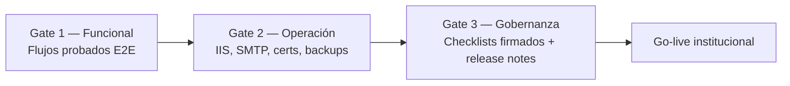

# Hoja de ruta — Fase de publicación oficial AOCR

**Versión:** 2026-06-11  
**Objetivo:** listar **todo lo que falta** para pasar de *piloto en `publicacion1`* a **publicación institucional aprobada** (QA → pre-prod → producción).

**Estado actual resumido:**

| Área | Completitud estimada | Bloquea go-live |
|------|---------------------|-----------------|
| Código flujo emisión (tipo 1/2) | ~85% | Parcial |
| Prueba E2E solicitud #12 hasta AOCR | ~40% | **Sí** |
| Modificación tipo 3 (escenarios C/D) | Código OK · prueba ☐ | **Sí** |
| Rama NC / informe insatisfactorio | ~20% | **Sí** |
| Endurecimiento plataforma (Nivel E) | ~35% | **Sí** |
| Documentación escrita | ~90% | No |
| Capturas PNG (42) | 0% | No (pero sí entrega usuario) |
| `CHECKLIST_PRODUCCION.md` (116 ítems) | 0% firmado | **Sí** |
| Deploy `publicacion1` | DLLs 11-jun-2026 | Reciclar IIS pendiente verificar |

**Regla de cierre (del propio proyecto):**  
100% funcional = Niveles **A + B + C + D + E** (`AOCR_FLUJO_INTEGRAL_MATRICES.md` §12) + dependencias externas + checklist producción.

---

## 1. Qué significa «fase de publicación»

No es solo copiar DLLs a IIS. La fase de publicación oficial exige **tres gates** independientes:



| Gate | Pregunta que debe responderse «Sí» |
|------|-------------------------------------|
| **1 Funcional** | ¿Un trámite emisión (#12 u otro) llegó de RT a AOCR emitido con todos los roles? |
| **2 Operación** | ¿El servidor prod tiene SMTP, certificados, BD, permisos y monitoreo? |
| **3 Gobernanza** | ¿QA, infra y PO firmaron `CHECKLIST_PRODUCCION.md`? |

Hoy el proyecto está **entre Gate 0 y Gate 1**: código desplegado en piloto, documentación lista, **validación E2E incompleta**.

---

## 2. Mapa de fases (orden recomendado)

| Fase | Nombre | Duración orientativa | Responsable | Entregable |
|------|--------|----------------------|-------------|------------|
| **0** | Preparación deploy | 0,5 día | Dev + Infra | Build Release + republicación verificada |
| **1** | Gate A — Regresión corta | 1 día | QA + Coordinación | Escenarios A–D (`GUIA_PRUEBAS_POST_REPUBLICACION.md`) |
| **2** | Gate B — Emisión completa #12 | 2–3 días | Todos los roles | COO-1 → INS-1 → DIR-1 → DIR-2 |
| **3** | Gate C — Modificación tipo 3 | 1 día | Inspector + RT | Escenarios C y D |
| **4** | Gate D — NC + Financiero | 1–2 días | Coord. + RT + Financiero | Caso 5 + FIN-1/FIN-2 |
| **5** | Gate E — Endurecimiento | 3–5 días dev | Desarrollo | DT-1 a DT-5 (priorizado abajo) |
| **6** | Pre-producción | 1–2 días | Infra + Seguridad | `CHECKLIST_IIS.md` + `CHECKLIST_PRODUCCION.md` §1–3 |
| **7** | Documentación usuario | 1 día | QA + Comunicaciones | 42 PNG + PDFs finales |
| **8** | Go-live | 0,5 día | Infra | Prod + smoke test + rollback listo |

**Total orientativo:** 10–15 días hábiles (paralelizando fases 5 y 7 parcialmente).

---

## 3. Fase 0 — Preparación deploy (obligatoria antes de cualquier prueba)

### 3.1 Qué falta

| ☐ | Tarea | Cómo verificar | Referencia |
|---|-------|----------------|------------|
| ☐ | Build **Release** sin errores | Visual Studio → Build Solution | `CHECKLIST_IIS.md` Pre-deploy |
| ☐ | Tests unitarios ejecutados y **verdes** | Test Explorer → Run All (~95 tests) | `AOCR.Tests` |
| ☐ | Publicar perfil `FolderProfile4` → destino acordado | Timestamps DLL recientes | `MANUAL_TECNICO_AOCR.md` §10 |
| ☐ | **Reciclar App Pool IIS** | Reinicio confirmado | `GUIA_PRUEBAS_POST_REPUBLICACION.md` §0.2 |
| ☐ | Ctrl+F5 / incógnito en cada sesión de prueba | CSS/JS no cacheados | Guía post-republicación §0.3 |
| ☐ | Tag Git + release notes borrador | `v2026.06.xx` | Operación estándar |

### 3.2 Archivos críticos en publicación

Confirmar fecha reciente en destino (ej. `C:\AOCR\publicacion1`):

```
bin\CapaDatos.dll
bin\CapaNegocio.dll
bin\CapaPresentacion.dll
Content\aocr-contrast.css
Content\aocr-datatables.css
Views\Documento\Lista.cshtml
Views\RevisionDocumental\Index.cshtml
Views\Inspeccion\Detalle.cshtml
Views\Tecnico\Index.cshtml
Views\SolicitudAOCR\Detalle.cshtml
```

**Última referencia conocida:** DLLs **11-jun-2026 ~15:56**.

---

## 4. Fase 1 — Gate A (regresión corta, 1 día)

**Documento guía:** `GUIA_PRUEBAS_POST_REPUBLICACION.md`  
**Meta:** confirmar que los fixes de la iteración no rompieron lo ya corregido.

| ☐ | ID | Escenario | Rol | Resultado esperado |
|---|-----|-----------|-----|-------------------|
| ☐ | A1 | Fix visual `/Tecnico` | Coordinación | Sin texto azul fantasma |
| ☐ | B2 | Firma coord. emisión #12 | Coordinación | → `Pendiente Asignacion RT` |
| ☐ | B3 | Descarga constancia | RT | **No** → `Finalizado` |
| ☐ | B4 | Asignación inspector #12 | Coordinación | → `En Inspeccion`, log `[GestionInspeccion]` |
| ☐ | C2 | Mod. con aeropuertos | Inspector | Solo cierre fase → `Requiere Inspeccion` |
| ☐ | C3 | RT orden post mod. | RT | Panel + `/OrdenRecaudacion/Nueva` |
| ☐ | D | Mod. sin aeropuertos | Inspector | Ramas CL / inspección clásicas |
| ☐ | A8 | Tests unitarios | Dev | Todos pasan |

**Evidencia:** capturas + líneas de log `[FirmarAceptacionDocumental]`, `[GestionInspeccion]`, `[DOC_FLOW]`.

**Criterio de salida Fase 1:** checklist consolidado guía post-republicación § consolidado — **8/8 ☐ → ✅**.

---

## 5. Fase 2 — Gate B (emisión completa, bloqueante principal)

**Meta Nivel B:** solicitud **#12** (o nueva tipo 1) desde RT hasta **AOCR Emitido/Recibido**.

**Documentos:** `MANUAL_FLUJO_RT_A_AOCR.md` · `GUIA_INSPECTOR_SOLICITUD_12.md` · `GUIA_VISUAL_FLUJO_RT_AOCR.md`

### 5.1 Cadena por rol (marcar en orden)

| ☐ | ID | Fase | Rol | Acción clave | Estado destino |
|---|-----|------|-----|--------------|----------------|
| ☐ | E2E-01 | 1–2 | RT | Solicitud + orden + comprobante | Pago pendiente |
| ☐ | E2E-02 | 3 | Financiero | Aprobar pago | Documentación habilitada |
| ☐ | E2E-03 | 4 | RT | Cargar docs + enviar | `En Revision` |
| ☐ | COO-1a | 5–6 | Coordinación | Revisión COO-1 + firma | `Pendiente Asignacion RT` |
| ☐ | COO-1b | 7 | Coordinación | Asignar inspector 43 | `En Inspeccion` |
| ☐ | INS-1a | 8 | Inspector | `modo=revision` — 12 docs PENDIENTE | Decisiones inspector |
| ☐ | INS-1b | 9 | Inspector | Confirmar cierre documental | LV habilitada |
| ☐ | INS-1c | 10 | Inspector | LV finalizada + firmada (.p12) | `firmado_tecnico=true` |
| ☐ | INS-1d | 11 | Inspector | Informe + firma | `ENVIADO_A_DIRDAC` |
| ☐ | DIR-1 | 12 | DIRDAC | Aprobar informe | `AOCR En Elaboracion` |
| ☐ | COO-2 | 14 | Coordinación | `ValidarAocr` | `AOCR En Revision` |
| ☐ | DIR-2 | 15 | DIRDAC | Firma AOCR | `AOCR Emitido/Recibido` |
| ☐ | RT-FIN | 16 | RT | `GeneradasFirmadas` — descarga PDF | Trámite operativo cerrado RT |

### 5.2 Puntos de fallo conocidos (vigilar)

| Síntoma | Revisar |
|---------|---------|
| Docs ACEPTADO sin acción inspector | URL debe ser `modo=revision`, no `modo=ver` |
| Bandeja revisión vacía | Inspector asignado en `aocr_tbinspeccion` |
| LV candado | Cierre documental no confirmado |
| Informe bloqueado | LV no firmada |
| AOCR no genera | Informe no aprobado DIRDAC |

### 5.3 Criterio de salida Fase 2

- PDF AOCR firmado descargado por RT desde **`/SolicitudAOCR/GeneradasFirmadas`**
- Log completo archivado
- Capturas fases 8–16 guardadas en `docs/images/`

---

## 6. Fase 3 — Gate C (modificación tipo 3)

**Documento:** `MANUAL_TECNICO_AOCR.md` §18 · Escenarios C y D guía post-republicación

| ☐ | Escenario | Condición | Acción | Estado final |
|---|-----------|-----------|--------|--------------|
| ☐ | **C** | Tipo 3 + `AeropuertosEcuador` | Inspector: `CerrarFaseDocumentalNuevoAeropuertoModificacion` | `Requiere Inspeccion` |
| ☐ | **C-RT** | Tras C | RT: `OrdenRecaudacion/Nueva` | Orden creada |
| ☐ | **D-CL** | Tipo 3 sin aeropuertos | Inspector: `GenerarCondicionesLimitacionesModificacion` | `Generado Condiciones y Limitaciones` |
| ☐ | **D-INS** | Tipo 3 sin aeropuertos | Inspector: `MarcarRequiereInspeccionModificacion` | `Requiere Inspeccion` |
| ☐ | **C-neg** | Con aeropuertos | Intentar CL directo → debe **rechazar** | Mensaje §18.4 |

**Criterio de salida:** 5/5 ☐ → ✅ + IDs de solicitud de prueba documentados.

---

## 7. Fase 4 — Gate D (NC + financiero)

| ☐ | ID | Qué probar | Documento |
|---|-----|------------|-----------|
| ☐ | FIN-1 | Pago aprobado + **un solo** correo por `event_key` | `PLAN_CIERRE_POR_ROL.md` |
| ☐ | FIN-2 | Contador sidebar financiero = filas bandeja | Idem |
| ☐ | COO-2 | Informe **no satisfactorio** → coordinación aprueba NC | `AOCR_FLUJO_INTEGRAL` Caso 5 |
| ☐ | RT-2 | RT **no** subsana antes de aprobación NC; **sí** después | Idem |

**Nota:** Caso 5 es el más largo; puede ejecutarse en paralelo a Fase 5 si hay otra solicitud de prueba.

---

## 8. Fase 5 — Gate E (endurecimiento técnico)

No bloquea piloto interno, **sí bloquea prod institucional** si no se mitiga.

### 8.1 Prioridad alta (antes de prod)

| ☐ | ID | Entregable | Archivos | Esfuerzo |
|---|-----|------------|----------|----------|
| ☐ | E1 / DT-1 | Migrar acciones críticas `InspeccionController` a `[AocrAuthorize]` | `InspeccionController.cs` (47 `[Authorize]` legacy restantes) | 2–3 días |
| ☐ | E3 / DT-3 | Auditar callers de `ObtenerDecisionRevisionDocumental` — siempre revisiones filtradas | `RevisionDocumentalService`, BL | 1 día |
| ☐ | ADM-1 | URL sin permiso → **403** en módulos críticos | Caso 6 matriz | 1 día QA |

### 8.2 Prioridad media (primer mes post go-live)

| ☐ | ID | Entregable | Esfuerzo |
|---|-----|------------|----------|
| ☐ | E2 / DT-2 | Botones flujo → `SolicitudAocrFlujoViewModel` | 3–5 días |
| ☐ | E4 / DT-5 | Revisión PDFs AOCR / CL / aceptación con Legal | 2–3 días |
| ☐ | E7 | Correos idempotentes en **todos** los eventos (no solo post-pago) | 2 días |
| ☐ | E6 / DT-4 | Retirar legacy `EstadosSolicitudAOCR` | 1–2 días |

### 8.3 Prioridad baja / mejora continua

| ☐ | ID | Entregable |
|---|-----|------------|
| ☐ | E5 | Casos 1–10 E2E automatizados o checklist firmado |
| ☐ | E10 | Test integración `FlujoCompletoTests` con BD (hoy `Inconclusive`) |
| ☐ | ADM-2 | Inventario AOCR legacy documentado |

---

## 9. Fase 6 — Pre-producción (infraestructura)

**Documentos:** `CHECKLIST_IIS.md` · `CHECKLIST_PRODUCCION.md` · `VARIABLES_AMBIENTE.md` · `CHECKLIST_SEGURIDAD.md`

### 9.1 Infraestructura mínima

| ☐ | Categoría | Ítems críticos |
|---|-----------|----------------|
| ☐ | IIS | App Pool .NET 4.8, permisos `App_Data`, SSL prod |
| ☐ | BD | `AOCR_CONNSTR_POSTGRESQL`, backup diario probado |
| ☐ | AS400 | ODBC + credenciales en variables de entorno (no Web.config plano) |
| ☐ | Email | SMTP prod + correo de prueba + cola `email_queue` |
| ☐ | Certificados | `.p12` LV, informe inspector, firma DIRDAC **vigentes en servidor** |
| ☐ | Seguridad | CSRF POST sensibles, upload validado, headers HSTS/CSP |
| ☐ | Observabilidad | Logs `App_Data/Logs`, rotación, health check |
| ☐ | Rollback | Backup pre-deploy + procedimiento documentado |

### 9.2 Dependencias externas (§12.6 matrices)

| ☐ | Dependencia | Responsable típico |
|---|-------------|-------------------|
| ☐ | Certificados digitales institucionales | DIRDAC / TI |
| ☐ | SMTP `no_reply@` validado en prod | Infra / correo DGAC |
| ☐ | Esquema BD estable (columnas críticas) | DBA |

---

## 10. Fase 7 — Documentación y comunicación

| ☐ | Entregable | Estado | Acción |
|---|------------|--------|--------|
| ☐ | Manuales PDF (`docs/export/`) | ✅ Generados | Distribuir a usuarios |
| ☐ | 42 capturas PNG | ☐ 0/42 | Recorrer flujo + `images/README.md` |
| ☐ | `npm run build` post-capturas | ☐ | Regenerar PDF con imágenes |
| ☐ | Release notes usuario | ☐ | Cambios visibles por rol |
| ☐ | Capacitación RT / Inspector / Coord. | ☐ | Sesión 2h con `MANUAL_FLUJO_RT_A_AOCR.md` |

**Checklist documentación:** `CHECKLIST_DOCUMENTACION_100.md`

---

## 11. Fase 8 — Go-live

### 11.1 Día D

| Hora | Acción |
|------|--------|
| T-24h | Backup BD + carpeta aplicación |
| T-1h | Publicar Release → prod |
| T-0 | Reciclar App Pool |
| T+15m | Smoke test: login cada rol + `/health` |
| T+30m | Smoke test: RT crea borrador (no prod data real si es prueba) |
| T+1h | Monitoreo logs 1 hora |

### 11.2 Smoke test mínimo post go-live

| ☐ | Prueba |
|---|--------|
| ☐ | Login RT, Coordinación, Inspector, Financiero, DIRDAC |
| ☐ | Sidebar contadores cargan sin error |
| ☐ | `/Tecnico/Index` sin error 500 |
| ☐ | `/RevisionDocumental/Index` inspector con sesión correcta |
| ☐ | Envío correo de prueba desde flujo financiero |
| ☐ | Log escribe en `App_Data/Logs` |

### 11.3 Rollback

Si falla Gate smoke: restaurar backup carpeta + BD según `CHECKLIST_IIS.md` § Rollback.

---

## 12. Matriz responsables (RACI simplificado)

| Actividad | Dev | QA | Infra | Coord. | Inspector | DIRDAC | RT | PO |
|-----------|-----|-----|-------|--------|-----------|--------|-----|-----|
| Fase 0 Deploy | **R** | C | **A** | I | I | I | I | I |
| Fase 1 Gate A | C | **R/A** | I | **R** | I | I | C | I |
| Fase 2 Gate B | C | **R** | I | **R** | **R** | **R** | **R** | **A** |
| Fase 3 Gate C | C | **R** | I | C | **R** | I | **R** | A |
| Fase 4 Gate D | C | **R** | I | **R** | C | C | **R** | A |
| Fase 5 Gate E | **R/A** | C | I | I | I | I | I | C |
| Fase 6 Pre-prod | C | C | **R/A** | I | I | I | I | C |
| Fase 7 Docs | C | **R** | I | C | C | C | C | **A** |
| Fase 8 Go-live | C | C | **R/A** | I | I | I | I | **A** |

R = Responsible · A = Accountable · C = Consulted · I = Informed

---

## 13. Resumen «qué falta» en una lista

### Bloqueantes absolutos (no prod sin esto)

1. **Gate B completo** — #12 (u otra emisión) hasta AOCR descargado por RT  
2. **Gate A** — escenarios A–D post-republicación  
3. **Reciclar IIS** + verificar DLLs actuales en servidor de prueba  
4. **CHECKLIST_PRODUCCION** — mínimo seguridad + QA E2E + firmas  
5. **SMTP + certificados** en servidor destino  
6. **Backup y rollback** probados  

### Importantes (prod con riesgo controlado / plan de remediación)

7. Gate C — modificación tipo 3  
8. Gate D — NC + financiero idempotente  
9. Gate E1 — autorización unificada Inspección  
10. 42 capturas PNG para manuales usuario  

### Mejora continua (post go-live primer mes)

11. DT-2 ViewModels en Razor  
12. DT-4 legacy constants  
13. Tests integración BD  
14. E7 correos idempotentes globales  

---

## 14. Documentos de referencia (índice)

| Documento | Uso en esta hoja de ruta |
|-----------|--------------------------|
| [HOJA_RUTA_PUBLICACION.md](HOJA_RUTA_PUBLICACION.md) | Este documento |
| [AOCR_FLUJO_INTEGRAL_MATRICES.md](AOCR_FLUJO_INTEGRAL_MATRICES.md) | Definición done §12 |
| [GUIA_PRUEBAS_POST_REPUBLICACION.md](GUIA_PRUEBAS_POST_REPUBLICACION.md) | Fase 1 Gate A |
| [GUIA_INSPECTOR_SOLICITUD_12.md](GUIA_INSPECTOR_SOLICITUD_12.md) | Fase 2 INS-1 |
| [MANUAL_FLUJO_RT_A_AOCR.md](MANUAL_FLUJO_RT_A_AOCR.md) | Fase 2 narrativa 16 fases |
| [GUIA_VISUAL_FLUJO_RT_AOCR.md](GUIA_VISUAL_FLUJO_RT_AOCR.md) | Capturas + textos UI |
| [PLAN_CIERRE_POR_ROL.md](PLAN_CIERRE_POR_ROL.md) | Entregables por rol |
| [CHECKLIST_DOCUMENTACION_100.md](CHECKLIST_DOCUMENTACION_100.md) | Docs + PNG + E2E |
| [CHECKLIST_PRODUCCION.md](CHECKLIST_PRODUCCION.md) | Gate gobernanza (116 ítems) |
| [CHECKLIST_IIS.md](CHECKLIST_IIS.md) | Fase 6 infra |
| [CHECKLIST_SEGURIDAD.md](CHECKLIST_SEGURIDAD.md) | Fase 6 seguridad |
| [VARIABLES_AMBIENTE.md](VARIABLES_AMBIENTE.md) | Config prod |

---

## 15. Próximo paso inmediato (mañana)

Si solo puedes hacer **una cosa** para avanzar a fase de publicación:

```text
1. Reciclar IIS en publicacion1
2. Ejecutar Gate A (8 escenarios) con GUIA_PRUEBAS_POST_REPUBLICACION.md
3. Si B4 OK → iniciar Gate B con inspector 43 en solicitud #12
   (GUIA_INSPECTOR_SOLICITUD_12.md desde Fase 2)
```

Cuando Gate B termine con PDF AOCR en mano del RT, el proyecto pasa de **~40%** a **~70%** hacia publicación oficial.

**Seguimiento semanal:** [export/editable/SEGUIMIENTO_PUBLICACION_AOCR.csv](export/editable/SEGUIMIENTO_PUBLICACION_AOCR.csv) · [instrucciones](export/editable/SEGUIMIENTO_PUBLICACION_README.md)

---

*Última actualización: 2026-06-11 — Consolidado desde auditoría de código, matrices §12, checklists prod/IIS y estado deploy `publicacion1`.*
