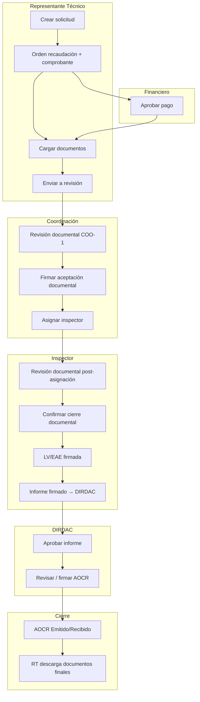

# Manual del flujo completo — Desde el RT hasta la AOCR emitida

**Versión:** 2026-06-11  
**Enfoque:** narrativa institucional **desde la perspectiva del Representante Técnico (RT)**, indicando en cada paso qué rol actúa, qué estado debe verse en `SolicitudAOCR/Detalle/{id}` y cuándo el RT puede volver a intervenir.

**Trámite de referencia:** solicitud **#12** (`DGAC-GOP-2026-AOCR012`), inspección **#11**, tipo **1** (emisión).

**Complementos:** [`GUIA_VISUAL_FLUJO_RT_AOCR.md`](GUIA_VISUAL_FLUJO_RT_AOCR.md) (42 capturas por fase) · `MANUAL_USUARIO_AOCR.md` · `GUIA_INSPECTOR_SOLICITUD_12.md` · `MANUAL_TECNICO_AOCR.md` (§16–§18) · [`CHECKLIST_DOCUMENTACION_100.md`](CHECKLIST_DOCUMENTACION_100.md)

---

## 0. Cómo leer este manual

| Columna / bloque | Significado |
|------------------|-------------|
| **Estado solicitud** | Texto exacto en columna `estado` de `aocr_tbsolicitud` |
| **Rol activo** | Quién debe actuar ahora |
| **Qué ve el RT** | Pantallas y mensajes desde `Mis trámites` o `Detalle` |
| **Acción institucional** | URL y POST del rol responsable |
| **Handoff** | Condición para pasar al siguiente rol |

El RT **no** interviene en revisión técnica post-asignación, LV, informe ni firma DIRDAC; sí debe **seguir el estado** y actuar cuando el trámite vuelve a su bandeja (subsanación, nueva orden de recaudación en modificación, descarga final).

> **Importante:** en la tabla §2, **«No» en participación RT ≠ paso fallido**. Indica que en esa fase el responsable es otro rol (Inspector, Coordinación o DIRDAC).

---

## 1. Mapa del recorrido (emisión tipo 1/2)



**Duración típica en estados (emisión):**

```text
(RT) Solicitud creada
  → Pago Pendiente / Validado          [Financiero]
  → Documentacion Pendiente            [RT carga docs]
  → En Revision                        [Coordinación COO-1]
  → Pendiente Asignacion RT            [Coordinación asigna]
  → En Inspeccion                      [Inspector]
  → AOCR En Elaboracion                [post-aprobación informe DIRDAC]
  → AOCR En Revision                   [Coordinación ValidarAocr]
  → Enviado DCAV → Firmado DCAV        [DIRDAC firma]
  → AOCR Emitido/Recibido              [RT descarga]
  → Finalizado                         [cierre operativo]
```

---

## 2. Tabla resumen — 16 fases y roles

### Leyenda columna «Participación RT»

| Símbolo | Significado | **No es** un error del sistema |
|---------|-------------|--------------------------------|
| **Sí** | El RT debe hacer acciones en esa fase | — |
| **Observa** | El RT solo consulta estado (Mis trámites / Detalle) | — |
| **No** | Otra institución actúa; el RT **espera** sin tareas pendientes | ❌ **No** significa fallo ni paso incompleto |

Las fases 8–11 y 13–14 llevan **No** porque corresponden a **Inspector**, **DIRDAC** o **Coordinación** — el RT no revisa documentos post-asignación, no firma LV/informe ni valida AOCR.

| Fase | Rol activo | Estado clave (antes → después) | Participación RT |
|------|------------|--------------------------------|------------------|
| **1** | RT | — → solicitud creada / pendiente pago | **Sí** — crea formulario |
| **2** | RT | — → orden + comprobante cargado | **Sí** |
| **3** | Financiero | Pago Pendiente → Validado | **Observa** — solo seguimiento |
| **4** | RT | Documentacion Pendiente → **En Revision** | **Sí** — carga y envía docs |
| **5** | Coordinación | En Revision (COO-1) | **Observa** — puede recibir observación |
| **6** | Coordinación | → **Pendiente Asignacion RT** | **Observa** — constancia descargable* |
| **7** | Coordinación | → **En Inspeccion** | **Observa** — espera inspección |
| **8** | Inspector | En Inspeccion — revisión doc. | **No** — actúa el inspector |
| **9** | Inspector | Cierre documental confirmado | **No** |
| **10** | Inspector | LV/EAE finalizada y firmada | **No** |
| **11** | Inspector | Informe → **ENVIADO_A_DIRDAC** | **No** |
| **12** | DIRDAC | → **AOCR En Elaboracion** | **Observa** |
| **13** | Inspector / sistema | Generación borrador AOCR | **No** |
| **14** | Coordinación | → **AOCR En Revision** | **No** |
| **15** | DIRDAC | → **AOCR Emitido/Recibido** | **Observa** |
| **16** | RT | Descarga documentos finales | **Sí** — `GeneradasFirmadas` |

\*Descargar la constancia de aceptación documental **no** cierra el trámite en `Finalizado`.

---

## Fase 1 — RT: iniciar la solicitud

📷 `images/rt/rt-formulario-emision-aocr.png` · `images/rt/rt-mis-tramites-solicitud-nueva.png` — ver [GUIA_VISUAL_FLUJO_RT_AOCR.md](GUIA_VISUAL_FLUJO_RT_AOCR.md) § Fase 1

### Menú y rutas

| Acción | Menú lateral RT | URL |
|--------|-----------------|-----|
| Emisión nueva | **Solicitud AOCR** | `/SolicitudAOCR/FormularioEmisionAOCR?tipoSolicitud=1` |
| Renovación | **Renovación AOCR** | `...?tipoSolicitud=2` |
| Modificación CL | **Condiciones y limitaciones** | `...?tipoSolicitud=3` |
| Seguimiento | **Mis trámites** | `/SolicitudAOCR/MisSolicitudes` |

### Procedimiento RT

1. Completar el formulario institucional (operadora, aeronaves, representante legal, etc.).
2. Guardar borrador si aún no tiene orden de recaudación.
3. Al finalizar el formulario inicial, el sistema crea o reutiliza la fila en `aocr_tbsolicitud`.

### Qué ve el RT

- Redirección a **Mis trámites** o mensaje de éxito con código de solicitud (ej. `DGAC-GOP-2026-AOCR012`).
- En **Detalle**, estado inicial compatible con pago pendiente o documentación pendiente según reglas de `AocrPostPagoWorkflowService`.

### Handoff → Fase 2

El RT debe generar la **orden de recaudación** antes de cargar documentación formal (menú **Órdenes (RT)** → **Nueva**).

---

## Fase 2 — RT: orden de recaudación y comprobante

### Menú y rutas

| Acción | Menú | URL |
|--------|------|-----|
| Nueva orden | **Órdenes (RT)** | `/OrdenRecaudacion/Nueva` |
| Mis órdenes | **Mis órdenes** | `/OrdenRecaudacion/Index` |
| Subir comprobante | **Subir comprobante** | `/OrdenRecaudacion/Index` → detalle orden |

### Procedimiento RT

1. Crear orden vinculada a la solicitud (`OrdenRecaudacion/Nueva`).
2. Realizar el pago institucional fuera del sistema (si aplica).
3. Cargar **comprobante de pago** (`COMPROBANTE_PAGO`) en la orden o en el detalle de recaudación.
4. Verificar que la orden aparezca como enviada a revisión financiera.

### Qué ve el RT

- Badge **warning** en menú de órdenes si hay comprobante pendiente.
- Detalle orden: estado pendiente de aprobación financiera.

### Handoff → Fase 3

La orden pasa a bandeja del **Financiero**. El RT espera notificación o refresca **Mis trámites**.

---

## Fase 3 — Financiero: aprobar el pago

> **Rol activo:** Financiero — el RT solo observa.

### Procedimiento Financiero

| Paso | Ruta |
|------|------|
| Bandeja | `/Financiero/TodasOrdenes` o `/Financiero/Dashboard` |
| Detalle | `/Financiero/DetalleOrden/{idOrden}` |
| Aprobar | `/Financiero/AprobarPago/{id}` o `AprobarPagoConFactura` |
| Rechazar | `/Financiero/RechazarOrden/{id}?motivo=...` |

### Qué ve el RT tras aprobación

- Estado solicitud avanza hacia **Documentacion Pendiente** (habilitado para carga documental).
- Menú **Documentos y expediente** activo.
- Correo institucional (canal `AocrEmailFlujoService`, evento idempotente).

### Handoff → Fase 4

Pago validado → RT debe cargar **todos** los tipos documentales obligatorios del trámite.

---

## Fase 4 — RT: cargar documentación y enviar a coordinación

### Menú y rutas

| Acción | Menú | URL |
|--------|------|-----|
| Subir archivos | **Documentos y expediente** | `/Documento/Subir?solicitudId={id}` |
| Ver expediente | Idem | `/Documento/Lista?solicitudId={id}&modo=ver` |
| Detalle trámite | **Mis trámites** → fila | `/SolicitudAOCR/Detalle/{id}` |
| Envío formal | Formulario completo / botón enviar en detalle | `POST SolicitudAOCR/FormularioCompleto` |

### Procedimiento RT

1. Subir cada tipo documental requerido (certificado aeronavegabilidad, manual operaciones, OPSPECS, AOC, etc.).
2. Verificar panel de documentos obligatorios faltantes en **Detalle** (lista vacía = listo).
3. Ejecutar **envío formal** al coordinador (`FormularioCompleto` con `requiereEnvioCoordinador`).
4. Confirmar transición a **`En Revision`**.

### Qué ve el RT

- Estado: **`En Revision`**
- Historial: *"Solicitud formal enviada al coordinador para revisión documental."*
- Ya **no** puede editar libremente todos los campos; subsanaciones futuras pasan por flujo de observación.

### Documentos excluidos del conteo documental

`SOLICITUD_INSPECCION_EXT` no cuenta para revisión documental institucional (`SolicitudAocrInfraBL.DebeIncluirEnRevisionDocumental`).

### Handoff → Fase 5

Coordinación recibe la solicitud en **Bandeja integral** / **Pendientes de revisión** (`CoordinacionJefatura/RevisionVerificacion`).

---

## Fase 5 — Coordinación: revisión documental pre-asignación (COO-1)

> **Rol activo:** Coordinación — RT en espera (puede ser observado).

### Condición en código

`EsRevisionDocumentalPreAsignacion` = sin inspector asignado + estado ∈ `{ En Revision, Documentacion Pendiente, Subsanada }`.

### Procedimiento Coordinación

| Paso | Ruta / acción |
|------|----------------|
| Bandeja | `/CoordinacionJefatura/RevisionVerificacion` |
| Revisar docs | Desde detalle o bandeja — aceptar/devolver por documento |
| Devolver a RT | Documento → estado **Observada** en solicitud |

### Si el RT recibe observaciones (rama lateral)

| Paso RT | Ruta |
|---------|------|
| Ver observados | **Observados y devueltos** → `MisSolicitudes` |
| Subsanar | `/SolicitudAOCR/Subsanar/{id}` |
| Reenviar | `POST SubsanarPost` → estado **`Subsanada`** → vuelve a coordinación |

### Qué ve el RT en flujo feliz

- Estado permanece **`En Revision`** hasta firma coordinador.
- Sin mensaje de observación activa.

### Handoff → Fase 6

Coordinación completa revisión COO-1 y ejecuta firma de aceptación documental.

---

## Fase 6 — Coordinación: firmar aceptación documental

### Procedimiento

| Elemento | Valor |
|----------|-------|
| **POST** | `/SolicitudAOCR/FirmarAceptacionDocumental/{id}` |
| **Autorización** | `[AocrAuthorize Modulo=CoordinacionJefatura Accion=FirmarAceptacionDocumental]` |
| **Servicio** | `RevisionDocumentalService.PrepararFirmaAceptacionDocumental` |
| **Log** | `[FirmarAceptacionDocumental]` |

### Estado destino

| Tipo solicitud | Estado después de firmar |
|----------------|--------------------------|
| **1** Emisión | **`Pendiente Asignacion RT`** |
| **2** Renovación | **`Pendiente Asignacion RT`** |
| **3** Modificación | **`Firmado Coordinador`** (ver Anexo A) |

### Qué ve el RT (tipo 1/2)

- Estado: **`Pendiente Asignacion RT`**
- Puede descargar PDF constancia de aceptación documental desde **Detalle**.
- **Importante:** esa descarga **no** cambia el estado a `Finalizado`.

### Handoff → Fase 7

Coordinación debe **asignar inspector** — el RT no puede acelerar este paso.

---

## Fase 7 — Coordinación: asignar inspector

### Procedimiento

1. `/Tecnico/Index` — bandeja `CoordinacionBandejaService.ObtenerPendientesAsignacion()`.
2. Enlace: `/Tecnico/AsignarInspector?solicitudId=12&tipoInspector=OPS`.
3. **POST** `Tecnico/AsignarInspector` con:
   - `inspectorPrincipal` (cédula/login del catálogo)
   - `fechaInspeccion`, `horaInspeccion`
   - `tipoInspector`: `OPS` | `AIR` | `TODOS`
4. Autorización: `[AocrAuthorize Modulo=Tecnico Accion=AsignarInspector]`.

### Resultado institucional

| Artefacto | Valor esperado (#12) |
|-----------|----------------------|
| Estado solicitud | **`En Inspeccion`** |
| Inspección | `aocr_tbinspeccion` — ej. codigo **11** |
| Inspector | ej. codigo **43** |
| Log | `[GestionInspeccion]` |

### Qué ve el RT

- **Detalle**: estado **`En Inspeccion`**, enlace a inspección si la UI lo muestra.
- El RT **no** revisa documentos en esta fase; eso es exclusivo del inspector asignado.

### Handoff → Fase 8

Inspector recibe fila en `/RevisionDocumental/Index` y `/Inspeccion/Index`.

---

## Fase 8 — Inspector: revisión documental post-asignación

> **Rol activo:** Inspector — RT no interviene.

### Regla crítica para el RT (expectativa)

Las revisiones del coordinador (COO-1, revisor id 45 en prueba #12) **no** sustituyen la decisión del inspector. En pantalla del inspector cada documento debe iniciar en **PENDIENTE** hasta que él acepte o devuelva.

### Procedimiento Inspector

| Paso | URL |
|------|-----|
| Bandeja | `/RevisionDocumental/Index` |
| Revisar (correcto) | `/Documento/Lista?solicitudId=12&modo=revision&origen=revision-documental` |
| Aceptar doc | `POST Documento/AceptarDocumentoSolicitud` |
| Devolver doc | `POST Documento/DevolverDocumentoSolicitud` (motivo ≥ 10 caracteres) |

### Textos UI que confirman modo correcto

| Elemento | Valor |
|----------|-------|
| Título tabla | **Bandeja de revisión documental** |
| Badge | **Revisión activa** |
| Estado fila | **PENDIENTE** → **ACEPTADO** |
| Modo incorrecto | `modo=ver` → **Archivos del expediente** / **Solo lectura** |

### Qué ve el RT

- Estado sigue **`En Inspeccion`**.
- Si inspector devuelve documento, RT podría recibir notificación y entrar en rama subsanación (Fase 5 lateral).

### Handoff → Fase 9

Todos los documentos aceptados por el inspector + botón **Confirmar fase documental** visible en bandeja.

---

## Fase 9 — Inspector: confirmar cierre documental

### Procedimiento

| Paso | Acción |
|------|--------|
| Pantalla | `/Inspeccion/Detalle/11` |
| Botón UI | **Confirmar cierre documental** |
| POST | `/Inspeccion/ConfirmarRevisionDocumentalInspector/11` |

### Persistencia

- `aocr_tbinspeccion.estado_documental` → `EN_REVISION` (u equivalente aprobado)
- Comentario: *"Inspector confirmó revisión documental"*

### Qué ve el RT

- Sin cambio de estado solicitud (`En Inspeccion`).
- Habilita internamente LV/EAE e informe para el inspector.

### Handoff → Fase 10

Inspector puede abrir modal LV/EAE sin candado **BLOQUEADO POR LV/EAE**.

---

## Fase 10 — Inspector: Lista de Verificación LV/EAE

### Secuencia obligatoria

| Orden | POST | Resultado |
|-------|------|-----------|
| 1 | `Inspeccion/GuardarListaVerificacionOperacionalEae` | Borrador en `aocr_tblv_operacional_eae` |
| 2 | `Inspeccion/FinalizarListaVerificacionOperacionalEae/{id}` | `finalizado=true`, PDF generado |
| 3 | `Inspeccion/FirmarListaVerificacionOperacionalEae` | `firmado_tecnico=true` (.p12) |

### Precondición

`RevisionDocumentalService.PuedeInspectorAbrirFaseOperativaLv` + cierre documental confirmado (§ Fase 9).

### Qué ve el RT

- Estado solicitud: **`En Inspeccion`**.
- Progreso invisible salvo consulta en detalle de inspección (si tiene permiso de lectura).

### Handoff → Fase 11

Badge UI inspector: **LV firmada** → habilita informe técnico.

---

## Fase 11 — Inspector: informe técnico y envío a DIRDAC

### Secuencia

| Orden | POST | Resultado |
|-------|------|-----------|
| 1 | `Inspeccion/GuardarInformeTecnico` | `estado_informe=BORRADOR_INFORME` |
| 2 | `Inspeccion/FinalizarInformeTecnico/{id}` | PDF informe |
| 3 | `Inspeccion/FirmarInformeInspector` | `FIRMADO_INSPECTOR` + **`ENVIADO_A_DIRDAC`** |

### Qué ve el RT

- Estado puede permanecer **`En Inspeccion`** hasta aprobación dirección.
- Correo/notificación interna a DIRDAC (`INFORME_TECNICO_ENVIADO_REVISION_DIRECCION`).

### Handoff → Fase 12

Informe aparece en `/Inspeccion/PendientesDireccion` para rol **DIRDAC**.

---

## Fase 12 — DIRDAC: aprobar informe técnico

> **Rol activo:** DIRDAC (`DireccionJefaturaTecnica`).

### Procedimiento

| Paso | Ruta |
|------|------|
| Bandeja | `/Inspeccion/PendientesDireccion` |
| Vista | `Views/InformeTecnico/PendientesDireccion.cshtml` |
| Aprobar / firmar informe | Acciones en `InspeccionController` (`FirmarInformeDirdac`, revisión dirección) |

### Estado solicitud tras aprobación

→ **`AOCR En Elaboracion`**

### Qué ve el RT

- **Detalle**: estado avanzó a fase AOCR.
- Mensaje de trámite en elaboración institucional; RT aún **no** descarga AOCR final.

### Handoff → Fases 13–14

Sistema / inspector generan borrador AOCR; coordinación valida formalmente.

---

## Fase 13 — Generación del documento AOCR

### Servicio

`GeneracionAOCRService` — evalúa:

1. Documentación aprobada (fase documental completa).
2. Informe aprobado por dirección (`ObtenerInformeAprobado`).
3. LV finalizada y firmada.
4. Estado solicitud en fase AOCR.

### Qué ocurre

- Se crea documento tipo `AOCR_GENERADO` en expediente.
- PDF institucional vía plantilla `Views/Certificado/CertificadoAOCR.cshtml` (dos páginas).

### Qué ve el RT

- Aún sin descarga final; estado **`AOCR En Elaboracion`**.

---

## Fase 14 — Coordinación: validación formal AOCR

### Procedimiento

| Elemento | Valor |
|----------|-------|
| Menú DIRDAC/Coord. | **AOCR y condiciones** |
| Ruta | `/CoordinacionJefatura/ValidarAocr?solicitudId={id}` |
| Autorización | `[AocrAuthorize Modulo=CoordinacionJefatura Accion=ValidarAocr]` |

Coordinación revisa texto, condiciones y limitaciones antes del envío a firma DIRDAC.

### Estado destino

→ **`AOCR En Revision`**

### Qué ve el RT

- Seguimiento en **Mis trámites** — trámite en revisión final institucional.

---

## Fase 15 — DIRDAC: firma y emisión AOCR

### Cadena de estados

```text
AOCR En Revision
  → Enviado DCAV      (envío a firma dirección)
  → Firmado DCAV      (firma digital DIRDAC)
  → AOCR Emitido/Recibido
```

### Menú DIRDAC

| Etiqueta | Ruta |
|----------|------|
| Listos para firma | `/Inspeccion/PendientesDireccion` |
| AOCR y condiciones | `/CoordinacionJefatura/ValidarAocr` |

### Qué ve el RT

- Estado: **`AOCR Emitido/Recibido`**
- Badge en menú **Documentos finales** / **Finalizados** incrementado.

### Handoff → Fase 16

Documentos PDF institucionales disponibles para descarga RT.

---

## Fase 16 — RT: descargar documentos finales

📷 `images/rt/rt-generadas-firmadas-bandeja.png` · `images/rt/rt-descarga-pdf-aocr-final.png` — ver [GUIA_VISUAL_FLUJO_RT_AOCR.md](GUIA_VISUAL_FLUJO_RT_AOCR.md) § Fase 16

### Menú y rutas

| Menú lateral | URL |
|--------------|-----|
| **Documentos finales** | `/SolicitudAOCR/GeneradasFirmadas` |
| **Finalizados** | Idem |
| **AOCR y condiciones** (vista RT) | Idem |

### Procedimiento RT

1. Abrir **GeneradasFirmadas**.
2. Filtrar por número de solicitud o estado **`AOCR Emitido/Recibido`**.
3. Descargar:
   - Certificado AOCR (PDF firmado)
   - Condiciones y limitaciones (si aplica)
   - Constancias vinculadas según tipo de trámite
4. Archivar en expediente operador.

### Cierre operativo

El estado **`Finalizado`** lo alcanza el trámite por transiciones institucionales posteriores (`Firmado DCAV` → `Finalizado` en flujos CL); para emisión AOCR el hito operativo del RT es **`AOCR Emitido/Recibido`** con PDF descargado.

---

## Anexo A — Modificación tipo 3 (desvío desde Fase 6)

Tras firma coordinador en tipo **3**, el estado es **`Firmado Coordinador`**, no `Pendiente Asignacion RT`.

```text
Firmado Coordinador
  ├─ Sin aeropuertos nuevos → Generar CL  O  Derivar inspección
  └─ Con AeropuertosEcuador → Inspector: CerrarFaseDocumentalNuevoAeropuertoModificacion
         → Requiere Inspeccion
         → RT: OrdenRecaudacion/Nueva (Fase 2 repetida)
         → Financiero → … → Fases 7–16 (flujo inspección estándar)
```

| Escenario | Rol | Acción POST | Estado destino |
|-----------|-----|-------------|----------------|
| Nuevo aeropuerto | Inspector | `CerrarFaseDocumentalNuevoAeropuertoModificacion` | `Requiere Inspeccion` |
| Sin aeropuerto — CL | Inspector | `GenerarCondicionesLimitacionesModificacion` | `Generado Condiciones y Limitaciones` |
| Sin aeropuerto — inspección | Inspector | `MarcarRequiereInspeccionModificacion` | `Requiere Inspeccion` |

**Qué hace el RT en `Requiere Inspeccion`:** panel en **Detalle** con enlace **`OrdenRecaudacion/Nueva`** (`RtDebeSolicitarInspeccionNuevoAeropuerto`).

Rama CL sin inspección cierra en firma DIRDAC de condiciones (`Enviado DCAV` → descarga CL), no AOCR de emisión.

---

## Anexo B — Informe no satisfactorio (NC)

Si el inspector marca informe **no satisfactorio**:

1. Coordinación aprueba plan de NC (`CoordinacionJefatura/DashboardInspeccion`).
2. RT subsana documentación **solo cuando** coordinación habilita la subsanación.
3. Puede requerirse **nueva inspección** u orden de recaudación adicional.

El RT debe monitorear **Observados y devueltos** y **Subsanaciones** en el menú lateral.

---

## Anexo C — Qué puede hacer el RT en cada estado

| Estado solicitud | Acciones RT disponibles |
|------------------|-------------------------|
| Documentacion Pendiente | Subir docs, completar formulario |
| En Revision | Consulta detalle; subsanar si **Observada** |
| Observada / Subsanada | **Subsanar** documentos devueltos |
| Pendiente Asignacion RT | Solo seguimiento; esperar asignación |
| En Inspeccion | Seguimiento; no revisa docs post-asignación |
| Requiere Inspeccion (mod.) | **OrdenRecaudacion/Nueva** |
| AOCR En Elaboracion / En Revision | Seguimiento |
| AOCR Emitido/Recibido | **GeneradasFirmadas** — descarga |
| Finalizado | Consulta histórica |

---

## Checklist trazabilidad — solicitud #12 (emisión)

Use esta lista para validar el recorrido completo con usuarios reales de cada rol:

| ☐ | Fase | Rol | Evidencia |
|---|------|-----|-----------|
| ☐ | 1–2 | RT | Solicitud #12 creada + orden recaudación |
| ☐ | 3 | Financiero | Pago aprobado |
| ☐ | 4 | RT | Estado `En Revision` tras envío docs |
| ☐ | 6 | Coordinación | `[FirmarAceptacionDocumental]` → `Pendiente Asignacion RT` |
| ☐ | 7 | Coordinación | `[GestionInspeccion]` → `En Inspeccion`, inspector 43 |
| ☐ | 8 | Inspector | 12 docs **PENDIENTE** en `modo=revision` |
| ☐ | 9 | Inspector | Cierre documental inspección #11 |
| ☐ | 10 | Inspector | LV firmada |
| ☐ | 11 | Inspector | Informe `ENVIADO_A_DIRDAC` |
| ☐ | 12 | DIRDAC | Aprobación informe → `AOCR En Elaboracion` |
| ☐ | 14 | Coordinación | `ValidarAocr` → `AOCR En Revision` |
| ☐ | 15 | DIRDAC | `AOCR Emitido/Recibido` |
| ☐ | 16 | RT | PDF descargado desde `GeneradasFirmadas` |

---

*Última actualización: 2026-06-11 — alineado a `SidebarMenuBuilder.cs`, `SolicitudAOCRController`, `RevisionDocumentalService`, `InspeccionController`, `GeneracionAOCRService`, `CoordinacionJefaturaController`.*
