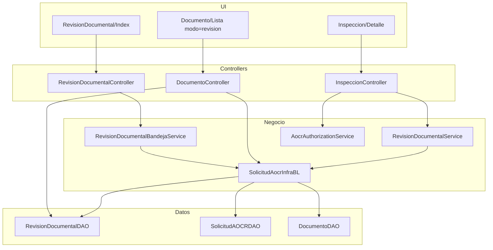

# Manual técnico — Sistema AOCR

**Versión:** 2026-06-11  
**Público:** desarrolladores, QA, arquitectos, soporte de producción  
**Objetivo:** documentar la implementación real del flujo AOCR para auditar si el código cumple las reglas institucionales.

**Documentos relacionados:** `MANUAL_USUARIO_AOCR.md` · `AOCR_FLUJO_INTEGRAL_MATRICES.md` · `ARQUITECTURA_DATOS.md`

---

## 0. Referencia de verificación — solicitud #12

| Artefacto | Valor / ubicación código |
|-----------|-------------------------|
| Solicitud | `CodigoSolicitud=12`, `NumeroSolicitud=DGAC-GOP-2026-AOCR012` |
| Inspección | `CodigoInspeccion=11` → `Inspeccion/Detalle/11` |
| Inspector | `CodigoTecnico=43` / `CodigoInspector=43` en `aocr_tbinspeccion` |
| Revisor COO-1 (histórico) | `codigo_usuario_revisor=45` en `aocr_tbrevision_documental` — **excluido** por `FiltrarDetallesRevisionPorInspector` |
| Script dev que generó COO-1 | `scripts/dev/advance_solicitud12_coo1.sql` — no ejecutar en prod |
| Publicación | `FolderProfile4` → `C:\AOCR\publicacion1` |
| Log | `CapaPresentacion/App_Data/Logs/AOCR_YYYYMMDD.log` |

**Prueba mínima post-fix revisión inspector:**

```http
GET /Documento/Lista?solicitudId=12&modo=revision&origen=revision-documental
→ ViewBag.EsFaseInspectorDocumental=true
→ ViewBag.PuedeRevisarDocumentos=true (inspector 43)
→ EstadoRevisionVisible=PENDIENTE (sin fila revisor 43 en aocr_tbrevision_documental)
```

---

## 1. Stack y estructura del repositorio

| Componente | Tecnología |
|------------|------------|
| Runtime | .NET Framework 4.8 |
| Web | ASP.NET MVC 5 |
| BD principal | PostgreSQL (Npgsql) |
| Legacy lectura | DB2/AS400 vía ODBC |
| Servidor | IIS 10+ |
| Tests | MSTest (`AOCR.Tests`) |

```
AOCR/
├── CapaPresentacion/     # MVC: controladores, vistas, filtros, helpers
├── CapaNegocio/          # Reglas de negocio, servicios de flujo
├── CapaDatos/            # DAOs, constantes SQL, acceso PostgreSQL/AS400
├── CapaModelo/           # Entidades de dominio
├── CapaUtilidades/       # Helpers transversales
├── AOCR.Tests/           # Tests unitarios de regresión
├── docs/                 # Documentación
└── scripts/              # SQL, seeds de prueba, deployment
```

### 1.1 Cadena de dependencias (flujo de estado)

```
EstadoSolicitud / EstadoSolicitudSql     ← persistencia canónica
         ↓
AocrEstadoService                      ← normalización C#
         ↓
AocrFlujoService                       ← transiciones y matriz rol×acción
         ↓
SolicitudEstadoTransitionBL            ← cambio de estado + historial + correo
AocrAuthorizationService               ← permisos por módulo/acción/recurso
*BandejaService / AocrSidebarCounterService ← bandejas = contadores
```

---

## 2. Capas y responsabilidades

### 2.1 CapaPresentacion

| Área | Ubicación | Responsabilidad |
|------|-----------|-----------------|
| Controladores MVC | `Controllers/*.cs` | Orquestación HTTP, ViewBag, JSON AJAX |
| Autorización UI | `Filters/SecurityFilters.cs`, `[AocrAuthorize]` | Bloqueo 403 antes de ejecutar acción |
| Menú lateral | `Helpers/SidebarMenuBuilder.cs` | Navegación por rol + badges |
| Contexto usuario | `Services/AocrUserContextService.cs` | Rol activo, compañía RT, IDs |
| Vistas | `Views/**` | Presentación; **no debe** ser única fuente de reglas de estado |

**Controladores críticos del flujo:**

| Controlador | Flujo |
|-------------|-------|
| `SolicitudAOCRController` | CRUD solicitud, firma aceptación documental, modificación AOCR |
| `DocumentoController` | Listado, revisión documental por documento |
| `TecnicoController` | Bandeja coordinación, asignación inspector |
| `InspeccionController` | LV, informe, cierre documental inspector |
| `RevisionDocumentalController` | Bandeja revisión documental inspector |
| `OrdenRecaudacionController` | Órdenes y pagos |
| `CoordinacionJefaturaController` | Revisión formal AOCR |

### 2.2 CapaNegocio — servicios de flujo

| Servicio | Archivo | Función |
|----------|---------|---------|
| `AocrFlujoService` | `Services/AocrFlujoService.cs` | Matriz transiciones; `RolPuedeEjecutarAccion` |
| `AocrEstadoService` | `Services/AocrEstadoService.cs` | Claves institucionales ↔ estados C# |
| `AocrAuthorizationService` | `Services/AocrAuthorizationService.cs` | Permisos LV, informe, AOCR, revisión documental |
| `AocrFlujoValidacionService` | `Services/AocrFlujoValidacionService.cs` | Cadena LV → Informe → AOCR |
| `RevisionDocumentalService` | `Services/RevisionDocumentalService.cs` | Cierre documental, firma aceptación, validaciones checklist |
| `SolicitudAocrInfraBL` | `SolicitudAocrInfraBL.cs` | Estado documental agregado, filtro revisiones inspector |
| `AocrPostPagoWorkflowService` | `Services/AocrPostPagoWorkflowService.cs` | Post-pago, bypass post-asignación coordinador |
| `AocrModificationWorkflowService` | `Services/AocrModificationWorkflowService.cs` | Rama modificación / nuevo aeropuerto |
| `CoordinacionBandejaService` | `Services/CoordinacionBandejaService.cs` | Bandeja coordinación |
| `InspectorBandejaService` | `Services/InspectorBandejaService.cs` | Bandeja inspecciones |
| `RevisionDocumentalBandejaService` | `Services/RevisionDocumentalBandejaService.cs` | Bandeja revisión documental inspector |
| `AocrSidebarCounterService` | `Services/AocrSidebarCounterService.cs` | Contadores = queries de bandeja |
| `AocrEmailFlujoService` | `Services/AocrEmailFlujoService.cs` | Correos idempotentes por `event_key` |

### 2.3 CapaDatos

| Componente | Función |
|------------|---------|
| `EstadoConstants.cs` / `EstadoSolicitudSql.cs` | Paridad estados C# ↔ SQL |
| `SolicitudAOCRDAO.cs` | CRUD solicitud, bandejas, asignación inspector |
| `RevisionDocumentalDAO.cs` | Tabla revisiones por documento + historial |
| `InspeccionDAO.cs` | Inspecciones por inspector (filtros post-asignación) |
| `DocumentoDAO.cs` | Metadatos y estado de archivos |
| `OrdenRecaudacionDAO` | Órdenes, pagos, historial |

---

## 3. Modelo de estados (referencia)

Claves institucionales (`AocrEstadoService.NormalizarClaveInstitucional`):

| Clave | Estado persistido | Responsable bandeja |
|-------|-------------------|---------------------|
| `DOCUMENTACION_EN_CARGA` | Pendiente | RT |
| `EN_REVISION_COORDINADOR` | En Revision | Coordinador |
| `PENDIENTE_ASIGNACION_INSPECTOR` | Pendiente Asignacion RT | Coordinador |
| `INSPECTOR_ASIGNADO` / `EN_INSPECCION` | En Inspeccion | Inspector |
| `AOCR_EN_ELABORACION` | AOCR En Elaboracion | Inspector/Coord. |
| `AOCR_ENVIADO_DIRDAC` | Enviado DCAV | DIRDAC |
| `DOCUMENTOS_FINALES_DISPONIBLES` | AOCR Emitido | RT |
| `CERRADO` | Finalizado | Historial |

**Reglas eliminadas en esta iteración:**

- Descargar PDF de aceptación documental **no** transiciona a `Finalizado`.
- `Firmado Coordinador` **no** transiciona directamente a `Finalizado`.

Fuente: `EstadoConstants.cs`, `AocrFlujoService.cs`, tests `EstadoSolicitudTransitionMatrixTests`.

---

## 4. Revisión documental — diseño e implementación

### 4.1 Dos fases distintas (regla de negocio)

| Fase | Condición | Revisor | Fuente revisiones | Inferencia desde `documento.estado` |
|------|-----------|---------|---------------------|-------------------------------------|
| **Pre-asignación (COO-1)** | Sin inspector asignado + estado `En Revision` / `Documentacion Pendiente` / `Subsanada` | Coordinador / Inspector rol | `ObtenerUltimasRevisionesPorSolicitud` | **Sí** — `Aprobado` cuenta como aceptado |
| **Post-asignación (inspector)** | `TieneInspectorAsignado()` = true | Inspector asignado | `ObtenerUltimasRevisionesInspectorPorSolicitud` | **No** — sin revisión del inspector = pendiente |

Detección pre-asignación:

```csharp
// SolicitudAocrInfraBL.EsRevisionDocumentalPreAsignacion
// true si NO hay inspector y estado ∈ { EnRevision, DocumentacionPendiente, Subsanada }
```

### 4.2 Filtrado de revisiones del inspector

```csharp
// SolicitudAocrInfraBL.ObtenerIdsInspectorAsignados
// IDs: solicitud.CodigoTecnico + inspeccion.CodigoInspector

// FiltrarDetallesRevisionPorInspector
// Solo detalles donde CodigoUsuarioRevisor ∈ idsInspector
```

Las revisiones del coordinador (usuario 45, observación COO-1) **permanecen en BD** pero **se excluyen** del cálculo de estado en fase inspector.

### 4.3 Cálculo de estado documental agregado

`SolicitudAocrInfraBL.ObtenerEstadoRevisionDocumental`:

1. Agrupa documentos vigentes por tipo (última versión).
2. Si hay inspector asignado → usa revisiones filtradas por inspector.
3. Por cada documento, `ObtenerDecisionRevisionDocumental(doc, revisiones, faseInspector)`:
   - Con revisión explícita → usa la decisión registrada.
   - En fase inspector **sin** revisión → retorna vacío (pendiente), **ignora** `documento.Estado = Aprobado`.
4. Deriva flags: `TienePendientes`, `DocumentacionAprobada`, `MensajeBloqueoDocumental`.
5. `ConfigurarFlujoDocumental` asigna responsable `INSPECTOR` / `COORDINADOR` / `RT`.

### 4.4 Presentación — DocumentoController

| Método | Comportamiento |
|--------|----------------|
| `AplicarContextoRevisionDocumental` | En fase inspector sin revisión: limpia `DecisionRevision`, `ObservacionRevision`, `NombreUsuarioRevisor` |
| `ObtenerEstadoDocumentoVisible(doc, faseInspector)` | Si `faseInspector` y sin decisión → **PENDIENTE** (no infiere desde `doc.Estado`) |
| `PuedeRevisarDocumentosSolicitud` | Inspector asignado puede revisar post-asignación |
| `ProcesarRevisionDocumentoSolicitud` | Registra decisión + observación del usuario actual en `RevisionDocumentalDAO` |

**Modos de lista:**

| Parámetro `modo` | Efecto |
|------------------|--------|
| `revision` / `revisar` | Habilita botones Aceptar/Devolver si `PuedeRevisarDocumentosSolicitud` |
| `ver` / (default) | Solo lectura — badge “Solo lectura” |

Vista `Documento/Lista.cshtml`:

- `ViewBag.EsFaseInspectorDocumental` evita fallback a `doc.Observaciones` / `doc.ValidadoPor` del coordinador.
- Columnas observación/revisor muestran solo datos de revisión del inspector en fase post-asignación.

### 4.5 Cierre documental del inspector

| Componente | Método / acción |
|------------|-----------------|
| UI | Botón “Confirmar cierre documental” en `Inspeccion/Detalle.cshtml` |
| HTTP | `POST Inspeccion/ConfirmarRevisionDocumentalInspector` |
| Validación | `RevisionDocumentalService.InspectorConfirmoCierreDocumental()` |
| Precondición LV | `RevisionDocumentalService.PuedeInspectorAbrirFaseOperativaLv()` |
| Autorización | `AocrAuthorizationService` — LV bloqueada sin confirmación explícita |

Confirmación explícita: `inspeccion.estado_documental = EN_REVISION` o comentario *"Inspector confirmó revisión documental"*.

### 4.6 Bandeja revisión documental

`RevisionDocumentalBandejaService.ObtenerItemsBandejaInspector`:

- Une solicitudes pendientes del DAO + inspecciones del inspector (`InspeccionDAO.ListarPorInspector`).
- Excluye ítems donde documentación aprobada **y** inspector ya confirmó cierre.
- Contador sidebar: `AocrSidebarCounterService` delega al mismo servicio.

---

## 5. Cadena operativa post-documental (resumen)

```
ConfirmarRevisionDocumentalInspector (#11)
  → Guardar/Finalizar/Firmar ListaVerificacionOperacionalEae
  → Guardar/Finalizar/FirmarInformeInspector → ENVIADO_A_DIRDAC
  → PendientesDireccion (aprobación DIRDAC)
  → AOCR En Elaboracion → ValidarAocr → firma DCAV
```

Detalle de implementación: **§16 (LV/EAE)**, **§17 (Informe técnico)**, **§18 (Modificación tipo 3)**.

---

## 6. Autorización

### 6.1 Mecanismos

| Mecanismo | Uso |
|-----------|-----|
| `[Authorize(Roles = "...")]` | Legacy — aún presente en partes de `InspeccionController` |
| `[AocrAuthorize(...)]` | Canónico — módulo, acción, recurso solicitud |
| `AocrPresentacionAuthorizationHelper` | Validación en acciones sin atributo |
| `AocrAuthorizationService` | Reglas de negocio (inspector asignado, fase documental, LV) |

### 6.2 Matriz rol × acción (backend)

Implementada en `AocrFlujoService.RolPuedeEjecutarAccion` — ver tabla completa en `AOCR_FLUJO_INTEGRAL_MATRICES.md` §4.

**Regla de auditoría:** toda acción visible en UI debe tener validación equivalente en controlador o servicio. Buscar acciones solo protegidas por `if` en Razor = brecha.

### 6.3 Brechas conocidas (Nivel E — pendiente)

- `InspeccionController`: híbrido `[Authorize(Roles)]` + servicios nuevos.
- `Detalle.cshtml`, `_FormularioEmisionAOCR.cshtml`: botones aún parcialmente en Razor (Fase 7).

---

## 7. Bandejas y contadores

**Regla institucional:** `SidebarMenuBuilder` → `AocrSidebarCounterService` debe usar **la misma query** que la bandeja del rol.

| Rol | Servicio bandeja | Contador |
|-----|------------------|----------|
| Coordinación | `CoordinacionBandejaService` | `ObtenerContadoresCoordinacion` |
| Inspector inspecciones | `InspectorBandejaService` | `ObtenerContadoresInspector` |
| Inspector revisión doc. | `RevisionDocumentalBandejaService` | Incluido en contador inspector |
| Financiero | `OrdenRecaudacionDAO` + `FinancialOrderStateHelper` | `ObtenerContadoresFinanciero` |
| DIRDAC | `DireccionBandejaService` | `ObtenerContadoresDireccion` |
| RT | Lógica RT en sidebar | `ObtenerContadoresRt` |

**Prueba:** comparar número del badge vs `COUNT(*)` de filas en pantalla de bandeja.

---

## 8. Persistencia relevante

### 8.1 Tablas principales (PostgreSQL)

| Tabla / entidad | Contenido |
|-----------------|-----------|
| `aocr_tbsolicitud` | Cabecera solicitud, estado, `tipo_solicitud`, `codigo_tecnico`, `AeropuertosEcuador` |
| Documentos (DAO `DocumentoDAO`) | Archivos, `estado`, `validado_por`, observaciones |
| `aocr_tbrevision_documental` | Decisiones por documento (`decision`, `observacion`, `codigo_usuario_revisor`, `fecha_revision`) |
| `aocr_tbhistorial_documental` | Eventos `DOCUMENTO_ACEPTADO`, `DOCUMENTO_DEVUELTO`, etc. |
| `aocr_tbinspeccion` | Inspector, `estado_documental`, `comentarios`, estado inspección |
| `aocr_tblv_operacional_eae` | LV/EAE por inspección (`finalizado`, `firmado_tecnico`, `estado_lista`, `items_json`) |
| `aocr_tbinforme_inspeccion` | Informe técnico (`finalizado`, `firmado_inspector`, `estado_informe`, `resultado`) |
| Órdenes recaudación / pagos | Flujo financiero |

### 8.2 Scripts de prueba

| Script | Propósito | ⚠️ |
|--------|-----------|-----|
| `scripts/dev/advance_solicitud12_coo1.sql` | Simula revisión COO-1 en solicitud #12 | No usar en producción; genera revisiones coordinador |

---

## 9. Correos y notificaciones

| Servicio | Idempotencia |
|----------|--------------|
| `AocrEmailFlujoService` | Por `event_key` de flujo |
| `AocrPostPagoWorkflowService` | Migrado a flujo idempotente |
| `SolicitudAocrCorreoService` | Deduplicación por evento |

Canal institucional: `no_reply@` (validar SMTP en entorno publicado).

---

## 10. Build, publicación y verificación

### 10.1 Compilar

```powershell
& "C:\Program Files\Microsoft Visual Studio\2022\Community\MSBuild\Current\Bin\MSBuild.exe" `
  "AOCR.sln" /t:Build /p:Configuration=Release
```

### 10.2 Publicar a IIS (perfil FolderProfile4)

```powershell
& "...\MSBuild.exe" "CapaPresentacion\CapaPresentacion.csproj" `
  /t:WebPublish /p:Configuration=Release /p:PublishProfile=FolderProfile4
```

Destino: `C:\AOCR\publicacion1`

### 10.3 Post-deploy

1. Reciclar Application Pool IIS.
2. Ctrl+F5 en navegador.
3. Verificar timestamps en `bin\CapaDatos.dll`, `CapaNegocio.dll`, `CapaPresentacion.dll`.
4. Ejecutar `GUIA_PRUEBAS_POST_REPUBLICACION.md` (escenarios A–D).
5. Cadena inspector: `GUIA_INSPECTOR_SOLICITUD_12.md`.

### 10.4 Logs

```
publicacion1\App_Data\Logs\AOCR_YYYYMMDD.log
```

Marcadores útiles: `[DOC_FLOW]`, `[DOC_SOLICITUD]`, `[GestionInspeccion]`, `[AUTH]`.

---

## 11. Tests unitarios de regresión

```powershell
vstest.console AOCR.Tests\bin\Release\AOCR.Tests.dll
```

| Archivo test | Qué valida |
|--------------|------------|
| `AocrEstadoServiceTests` | Normalización estados |
| `AocrFlujoServiceTests` | Transiciones, FirmadoCoordinador |
| `EstadoSolicitudTransitionMatrixTests` | Sin atajo a Finalizado |
| `RevisionDocumentalFirmaPlanningTests` | Destino firma por tipo 1/2/3 |
| `AocrModificationNuevoAeropuertoTests` | Rama nuevo aeropuerto |
| `AocrModificationAuthorizationTests` | Permisos cierre fase mod. |
| `RevisionDocumentalBandejaServiceTests` | Bandeja inspector |
| `CoordinacionBandejaEstadoTests` | Bandeja coordinación |
| `OperationalFlowCharacterizationTests` | Cableado servicio ↔ controlador |

---

## 12. Checklist técnico — ¿La implementación es correcta?

Use este checklist al revisar código o QA técnico.

### 12.1 Revisión documental inspector

| # | Criterio | Archivo / método | ✅ |
|---|----------|------------------|---|
| T1 | Con inspector asignado, sin revisión inspector → doc pendiente | `ObtenerDecisionRevisionDocumental(..., faseInspector:true)` | ☐ |
| T2 | Revisiones coordinador excluidas del conteo | `FiltrarDetallesRevisionPorInspector` | ☐ |
| T3 | UI no muestra ValidadoPor coordinador en fase inspector | `Lista.cshtml` + `AplicarContextoRevisionDocumental` | ☐ |
| T4 | `modo=revision` habilita Aceptar/Devolver al inspector asignado | `DocumentoController.PuedeRevisarDocumentosSolicitud` | ☐ |
| T5 | LV bloqueada hasta confirmación cierre | `RevisionDocumentalService.PuedeInspectorAbrirFaseOperativaLv` | ☐ |
| T6 | Bandeja revisión documental lista solicitudes asignadas | `RevisionDocumentalBandejaService` | ☐ |

### 12.2 Flujo emisión (solicitud #12)

| # | Criterio | Verificación concreta | ✅ |
|---|----------|----------------------|---|
| E1 | Firma coord. → `Pendiente Asignacion RT` | `FirmarAceptacionDocumental/12` + log `[FirmarAceptacionDocumental]` | ☐ |
| E2 | Asignación → `En Inspeccion` | `Tecnico/AsignarInspector` + `aocr_tbinspeccion.codigo_inspector=43` | ☐ |
| E3 | Post-asignación sin bloqueo pago | `PuedeInspectorIniciarRevisionDocumental(11)` = true | ☐ |
| E4 | LV §16 + Informe §17 completos | Tablas `aocr_tblv_operacional_eae` + `aocr_tbinforme_inspeccion` | ☐ |
| E5 | Informe → `ENVIADO_A_DIRDAC` | `FirmarInformeInspector/11` + bandeja `PendientesDireccion` | ☐ |

### 12.3 Modificación tipo 3

| # | Criterio | Verificación concreta | ✅ |
|---|----------|----------------------|---|
| M1 | Con aeropuertos → solo cierre fase | `CerrarFaseDocumentalNuevoAeropuertoModificacion` → `Requiere Inspeccion` §18.5 | ☐ |
| M2 | Sin aeropuertos → CL o inspección | `GenerarCondicionesLimitacionesModificacion` **xor** `MarcarRequiereInspeccionModificacion` | ☐ |
| M3 | Post `Requiere Inspeccion` → orden RT | Panel `RtDebeSolicitarInspeccionNuevoAeropuerto` + `OrdenRecaudacion/Nueva` | ☐ |
| M4 | Bloqueo CL con aeropuertos | `PrepararGeneracionCondicionesLimitaciones` retorna error §18.4 | ☐ |
| M5 | Firma coord. tipo 3 | Destino `Firmado Coordinador` (`RevisionDocumentalFirmaPlanningTests`) | ☐ |

### 12.4 Plataforma

| # | Criterio | ✅ |
|---|----------|---|
| P1 | Contador sidebar = bandeja por rol | ☐ |
| P2 | URL sin permiso → 403 | ☐ |
| P3 | Correo post-pago idempotente | ☐ |
| P4 | Tests §11 pasan en CI/local | ☐ |

**Implementación correcta (mínimo operativo):** T1–T6 + E1–E4 ✅ en entorno publicado con prueba manual solicitud #12.

**Implementación completa (100%):** todos los niveles A–E de `AOCR_FLUJO_INTEGRAL_MATRICES.md` §12.

---

## 13. Diagrama de componentes — revisión documental



---

## 16. Lista de Verificación LV/EAE — implementación

### 16.1 Alcance y persistencia

| Elemento | Valor en código |
|----------|-----------------|
| Tabla PostgreSQL | `public.aocr_tblv_operacional_eae` |
| DAO | `ListaVerificacionOperacionalEaeDAO` |
| Modelo | `ListaVerificacionOperacionalEae` |
| Vista modal | `Views/Inspeccion/Detalle.cshtml` → modal `#modalListaVerificacionOperacionalEae` |
| Panel parcial | `Views/Inspeccion/_ListaVerificacionOperacionalEaePanel.cshtml` |

**Clave foránea:** `codigo_inspeccion` → inspección **#11** (solicitud #12).

**Columnas de control de fase:**

| Columna BD | Propiedad C# | Significado |
|------------|--------------|-------------|
| `finalizado` | `Finalizado` | PDF LV generado (`FinalizarListaVerificacionOperacionalEae`) |
| `firmado_tecnico` | `FirmadoTecnico` | Certificado `.p12` aplicado |
| `estado_lista` | `EstadoLista` | Ej. `BORRADOR`, estado post-firma |
| `items_json` | `ItemsJson` | Criterios cumplimiento/implementación |
| `ruta_pdf` / `ruta_documento_firmado` | Rutas en `App_Data/Documentos/...` |

### 16.2 Precondiciones (orden enforced)

Para **cualquier** acción LV el inspector asignado debe cumplir, en este orden:

1. `AocrPostPagoWorkflowService.PuedeInspectorIniciarRevisionDocumental(codigoInspeccion)` — bypass post-asignación coordinador.
2. `SolicitudAocrInfraBL.ObtenerEstadoRevisionDocumental` → `DocumentacionAprobada = true` (decisiones del **inspector**, no COO-1).
3. `InspectorTieneRevisionDocumentalConfirmada(inspeccion)` → delega a `RevisionDocumentalService.InspectorConfirmoCierreDocumental`:
   - `aocr_tbinspeccion.estado_documental` ∈ `{ EN_REVISION, ACEPTADA, APROBADO }`, **o**
   - `comentarios` contiene *"Inspector confirmó revisión documental"*.
4. `AocrAuthorizationService.PuedeInspectorAbrirLv` → alias de `PuedeInspectorAbrirInspeccion` → `RevisionDocumentalService.PuedeInspectorAbrirFaseOperativaLv`.

**Escritura al confirmar cierre** (`InspeccionController.ConfirmarRevisionDocumentalInspector`):

```csharp
inspeccion.EstadoDocumental = "EN_REVISION";
inspeccion.Comentarios += " | Inspector confirmó revisión documental.";
// _inspeccionBL.Actualizar(inspeccion, usuarioId);
```

### 16.3 Endpoints HTTP

| Paso | Método | Ruta | `[AocrAuthorize]` | Validación adicional |
|------|--------|------|-------------------|----------------------|
| Guardar borrador | POST | `Inspeccion/GuardarListaVerificacionOperacionalEae` | `GuardarListaVerificacionOperacionalEae` | `InspectorTieneRevisionDocumentalConfirmada` |
| Finalizar PDF | POST | `Inspeccion/FinalizarListaVerificacionOperacionalEae/{id}` | `FinalizarListaVerificacionOperacionalEae` | Idem + `lista.Finalizado` antes de firmar |
| Firmar | POST | `Inspeccion/FirmarListaVerificacionOperacionalEae` | `FirmarListaVerificacionOperacionalEae` | Idem + `lista.Finalizado == true` + certificado |

**Mensajes de error exactos (controller):**

| Condición | HTTP | Texto |
|-----------|------|-------|
| Sin cierre documental | 403 | *"No se puede iniciar la inspección porque la fase documental aún no ha sido finalizada."* (`ObtenerMensajeBloqueoRevisionDocumentalInspector`) |
| LV no finalizada al firmar | 409 | *"Debe finalizar la lista de verificación operacional EAE antes de firmarla."* |
| Flujo EAE no aplica | 409 | *"La lista de verificación operacional EAE no aplica para esta inspección."* (`UsaFlujoListaVerificacionOperacionalEae`) |

**Autorización denegada (`AocrAuthorizationService`):** rol debe ser `InspectorTecnico` o `Administrador`; usuario debe ser inspector asignado en `aocr_tbinspeccion`.

### 16.4 Textos UI (`Detalle.cshtml`)

| Estado LV | Texto badge |
|-----------|-------------|
| Pendiente | *LV pendiente* |
| Borrador | *LV en borrador* |
| Finalizada sin firma | *LV completada* |
| Firmada | *LV firmada* |

Botón habilitado: **Completar LV en ventana** / **Abrir ventana LV** (si `listaVerificacionFirmada`).  
Botón bloqueado: **Abrir LV/EAE** con candado + *"BLOQUEADO POR LV/EAE"* en panel informe.

### 16.5 Verificación QA — inspección #11

| # | Consulta / acción | Esperado |
|---|-------------------|----------|
| LV1 | Sin `ConfirmarRevisionDocumentalInspector` → POST Guardar LV | 403 |
| LV2 | Tras confirmar cierre → Guardar LV | 200, fila en `aocr_tblv_operacional_eae` |
| LV3 | Finalizar LV | `finalizado=true`, `ruta_pdf` poblada |
| LV4 | Firmar LV | `firmado_tecnico=true`, `fecha_firma` poblada |
| LV5 | `AocrFlujoValidacionService.PuedeGenerarInformeTecnico(11)` | `true` solo si LV4 OK |

---

## 17. Informe técnico — implementación

### 17.1 Alcance y persistencia

| Elemento | Valor en código |
|----------|-----------------|
| Tabla | `public.aocr_tbinforme_inspeccion` |
| DAO | `InspeccionInformeDAO` |
| Modelo | `InspeccionInformeTecnico` |
| Modal UI | `GET Inspeccion/ModalInformeTecnico` → `Views/Inspeccion/_ModalInformeTecnico.cshtml` (vía `Detalle.cshtml`) |
| Bandeja DIRDAC | `GET Inspeccion/PendientesDireccion` → `Views/InformeTecnico/PendientesDireccion.cshtml` |

**Columnas de control:**

| Columna | Uso |
|---------|-----|
| `finalizado` | PDF informe generado (`FinalizarInformeTecnico`) |
| `firmado_inspector` | Firma inspector completada |
| `firmado_dirdac` | Firma/aprobación dirección |
| `estado_informe` | Máquina de estados (ver §17.4) |
| `resultado` | Satisfactorio / No satisfactorio |
| `no_conformidades` | Obligatorio si no satisfactorio |
| `fecha_envio_dirdac` | Tras `FirmarInformeInspector` con `autoEnviarADirdac=true` |

### 17.2 Precondiciones por acción

**Abrir / guardar informe** (`GuardarInformeTecnico`, `ModalInformeTecnico`):

1. `InspectorTieneRevisionDocumentalConfirmada` — mismo criterio que LV §16.2.
2. `AocrAuthorizationService.PuedeInspectorGenerarInforme`:
   - `PuedeInspectorAbrirInspeccion` (cierre documental + fase operativa).
   - `AocrFlujoValidacionService.PuedeGenerarInformeTecnico`:
     ```csharp
     var lista = _listaVerificacionDao.ObtenerUltimaPorInspeccion(codigoInspeccion);
     return lista != null && lista.Finalizado && lista.FirmadoTecnico;
     ```
   - Informe inexistente o `EstadoInforme == BORRADOR_INFORME`.

**Mensaje auth si LV no lista:** *"Debe finalizar y firmar la LV antes de gestionar el Informe Técnico."* (`AocrAuthorizationService.ValidarRecurso`).

**Finalizar informe** (`FinalizarInformeTecnico/{id}`):

- Mismas precondiciones + contenido mínimo en formulario.
- Llama `InspeccionInformeDAO.MarcarFinalizado` → `finalizado=true`, genera PDF en disco.

**Firmar informe inspector** (`FirmarInformeInspector`):

- `AocrFlujoValidacionService.PuedeFirmarInformeTecnico`:
  - `informe.Finalizado == true`
  - `informe.FirmadoInspector == false`
  - `resultado` no vacío
  - Si no satisfactorio: `NoConformidades` u `Observaciones` no vacíos
- `ValidarPrecondicionListaVerificacionOperacionalEae` — LV finalizada y firmada.
- Ejecuta `FirmarInformePorRol(..., "INSPECTOR", "FIRMADO_INSPECTOR", autoEnviarADirdac: true)`.

### 17.3 Envío automático a DIRDAC

Tras firma inspector (`FirmarInformePorRol`):

```csharp
_informeDAO.MarcarEnviadoADirdac(..., "ENVIADO_A_DIRDAC", usuarioId);
// evento correo: INFORME_TECNICO_ENVIADO_REVISION_DIRECCION
```

**Estado informe post-firma inspector:** `FIRMADO_INSPECTOR` → transición a `ENVIADO_A_DIRDAC`.

El inspector **no** genera AOCR en esta etapa (`GeneracionAOCRService` exige informe aprobado por dirección).

### 17.4 Máquina de estados `estado_informe`

| Valor | Cuándo |
|-------|--------|
| `BORRADOR_INFORME` | Tras primer guardado |
| `FIRMADO_INSPECTOR` | Post `FirmarInformeInspector` |
| `ENVIADO_A_DIRDAC` | Auto-envío a bandeja dirección |
| `ENVIADO_A_COORDINADOR` | Flujo coordinación (devoluciones) |
| `DEVUELTO_COORDINADOR` | Devolución desde coordinación |

**Bandeja DIRDAC:** `InspeccionInformeDAO.ListarPendientesFirmaDirdac()` — filtra `firmado_inspector=true` y `firmado_dirdac=false`.

**Autorización dirección:** `AocrAuthorizationService.PuedeDirectorRevisarInforme(codigoInforme, userId)`.

### 17.5 Resultado satisfactorio / NC

Detección en `AocrFlujoValidacionService`:

```csharp
// Satisfactorio: contiene "SATISFACT" y NO "NO SATISFACT"
// No satisfactorio: "NO SATISFACT", "NO_SATISFACT", "NO SATISFACTORIO"
```

Rama NC (Caso 5 — pendiente prueba manual completa): coordinación aprueba NC → RT subsana → nueva inspección. Servicios: `CoordinacionBandejaService`, panel `#pane-observaciones` en `DashboardInspeccion`.

### 17.6 Generación AOCR (post-informe)

`GeneracionAOCRService.Evaluar` exige:

1. Documentación aprobada (`RevisionDocumentalService.ObtenerEstadoFaseDocumental`).
2. Estado solicitud en fase AOCR (`EstadoSolicitudPermiteGeneracion`).
3. `ObtenerInformeAprobado(codigoSolicitud)` — informe con aprobación institucional DIRDAC.

**Motivo típico de bloqueo:** *"El Informe Técnico ya debe estar aprobado por Dirección/DIRDAC y la solicitud debe encontrarse en fase AOCR para generar la AOCR."*

### 17.7 Verificación QA — inspección #11

| # | Acción | Esperado |
|---|--------|----------|
| INF1 | Abrir informe sin LV firmada | 403 / mensaje LV |
| INF2 | Guardar borrador | Fila `aocr_tbinforme_inspeccion`, `estado_informe=BORRADOR_INFORME` |
| INF3 | FinalizarInformeTecnico/11 | `finalizado=true`, PDF en `App_Data` |
| INF4 | FirmarInformeInspector | `firmado_inspector=true`, `ENVIADO_A_DIRDAC` |
| INF5 | PendientesDireccion | Informe #12 visible para rol DIRDAC |
| INF6 | Tras aprobación DIRDAC | Solicitud → `AOCR En Elaboracion` |

**Logs:** `[GestionInspeccion] GuardarInformeTecnico`, `FinalizarInformeTecnico`, `FirmarInformeInspector`, `INFORME_TECNICO_ENVIADO_REVISION_DIRECCION`.

---

## 18. Modificación tipo 3 — implementación

### 18.1 Identificación

```csharp
// AocrModificationWorkflowService.EsSolicitudModificacion
solicitud.TipoSolicitud.GetValueOrDefault() == 3

// Formulario RT
GET SolicitudAOCR/FormularioEmisionAOCR?tipoSolicitud=3
```

**Detección nuevo aeropuerto:**

```csharp
TieneNuevoAeropuertoDeclarado(solicitud)
  = TipoSolicitud == 3
    AND (AeropuertosEcuador no vacío OR AeropuertosEcuadorOtros no vacío)
```

Campos en `aocr_tbsolicitud`: `AeropuertosEcuador`, `AeropuertosEcuadorOtros`.

### 18.2 Punto de entrada institucional

Tras firma coordinador en modificación:

- `POST SolicitudAOCR/FirmarAceptacionDocumental/{id}` con `tipoSolicitud=3`
- Destino: **`Firmado Coordinador`** (no `Pendiente Asignacion RT`)
- Servicio: `RevisionDocumentalService.ResolverEstadoDestinoFirmaAceptacionDocumental(3)` → `EstadoSolicitud.FirmadoCoordinador`

Desde **`Firmado Coordinador`** o **`Aceptacion Documental`** el inspector resuelve en panel `SolicitudAOCR/Detalle/{id}` — sección *Resolución de modificación* (`Detalle.cshtml`).

### 18.3 Ramas y acciones POST

| Rama | Condición | Acción POST | Servicio | Estado destino |
|------|-----------|-------------|----------|----------------|
| **A — CL directo** | Sin aeropuertos nuevos | `GenerarCondicionesLimitacionesModificacion` | `EjecutarGeneracionCondicionesLimitaciones` | `Generado Condiciones y Limitaciones` |
| **B — Derivar inspección** | Sin aeropuertos nuevos | `MarcarRequiereInspeccionModificacion` | `EjecutarRequiereInspeccion` | `Requiere Inspeccion` |
| **C — Nuevo aeropuerto** | `TieneNuevoAeropuertoDeclarado` | `CerrarFaseDocumentalNuevoAeropuertoModificacion` | `EjecutarCierreFaseDocumentalNuevoAeropuerto` | `Requiere Inspeccion` |

**Autorización acciones inspector (A, B, C):** `[Authorize(Roles = "Inspector,Administrador")]` — pendiente migración a `[AocrAuthorize]` (deuda DT-1).

**Transición de estado:** `SolicitudEstadoTransitionBL.CambiarEstadoConReglasAocr` + validación `AocrFinalWorkflowService.UsuarioPuedeTransicionarEstadoAocr`.

### 18.4 Mensajes de rechazo exactos (`Preparar*`)

| Método | Condición fallo | Mensaje |
|--------|-----------------|---------|
| `PrepararRequiereInspeccion` | Con aeropuertos | *"La modificación declara inclusión de nuevo aeropuerto. Debe usar el cierre institucional de fase documental..."* |
| `PrepararGeneracionCondicionesLimitaciones` | Con aeropuertos | *"...no puede cerrarse con Condiciones y Limitaciones directas. Debe derivar al módulo de solicitud de inspección."* |
| `PrepararCierreFaseDocumentalNuevoAeropuerto` | Sin aeropuertos | *"El cierre de fase documental por nuevo aeropuerto solo aplica cuando la modificación declara aeropuertos en Ecuador."* |
| Cualquiera | Estado ≠ `Aceptacion Documental` | *"Solo puede ... cuando la documentación de la modificación ya fue aceptada."* |

### 18.5 Flujo post-`Requiere Inspeccion` (rama C y B)

1. Estado solicitud = **`Requiere Inspeccion`**
2. UI RT: `AocrModificationWorkflowService.RtDebeSolicitarInspeccionNuevoAeropuerto` → panel con enlace **`OrdenRecaudacion/Nueva`**
3. RT genera orden + comprobante → financiero aprueba
4. Coordinación asigna inspector (`Tecnico/AsignarInspector`) → flujo estándar §5–§17 (emisión/inspección)

**Observación persistida rama C:**

*"Cierre de fase documental por inclusión de nuevo aeropuerto. El RT debe solicitar inspección mediante orden de recaudación."*

### 18.6 Flujo CL sin inspección (rama A)

```
Generado Condiciones y Limitaciones
  → POST RevisarCondicionesLimitacionesModificacion (Coordinación)
  → En Revision Coordinador Final
  → POST envío DCAV (PrepararEnvioDcavCondicionesLimitaciones)
  → Enviado DCAV
  → firma DIRDAC → descarga SolicitudAOCR/DescargarCondicionesLimitacionesModificacion
```

**Coordinación:** `[Authorize(Roles = "Coordinador,CoordinadorInspecciones,Coordinacion,Administrador")]` en `RevisarCondicionesLimitacionesModificacion`.

### 18.7 Helpers UI en `Detalle.cshtml`

| Flag ViewModel / helper | Efecto |
|-------------------------|--------|
| `EsResolucionModificacionConNuevoAeropuerto` | Muestra solo botón cierre fase documental |
| `RtDebeSolicitarInspeccionNuevoAeropuerto` | Muestra enlace orden recaudación |
| Panel bifurcado sin aeropuertos | Botones CL + derivar inspección |

Fuente: `AocrModificationWorkflowService.EsResolucionModificacionConNuevoAeropuerto` y `RtDebeSolicitarInspeccionNuevoAeropuerto`.

### 18.8 Tests unitarios

| Archivo | Cobertura |
|---------|-----------|
| `AocrModificationNuevoAeropuertoTests` | Planes `PrepararCierreFaseDocumentalNuevoAeropuerto`, bloqueos CL/inspección |
| `AocrModificationAuthorizationTests` | Autorización acción cierre fase |
| `RevisionDocumentalFirmaPlanningTests` | Firma tipo 3 → `FirmadoCoordinador` |

### 18.9 Verificación QA — Escenarios C y D (guía post-republicación)

| Escenario | Solicitud | Acción inspector | Estado final |
|-----------|-----------|------------------|--------------|
| **C** — con aeropuertos | Mod. tipo 3 con `AeropuertosEcuador` | Solo `CerrarFaseDocumentalNuevoAeropuertoModificacion` | `Requiere Inspeccion` |
| **D** — sin aeropuertos | Mod. tipo 3 campos vacíos | `GenerarCondicionesLimitacionesModificacion` **o** `MarcarRequiereInspeccionModificacion` | `Generado CL` o `Requiere Inspeccion` |

**Validación negativa Escenario C:** intentar `MarcarRequiereInspeccionModificacion` con aeropuertos declarados → TempData warning con mensaje §18.4.

---

| ID | Descripción | Fase plan |
|----|-------------|-----------|
| DT-1 | Autorización híbrida en `InspeccionController` | 4 |
| DT-2 | Lógica botones en Razor (`Detalle.cshtml`) | 7 |
| DT-3 | `RevisionDocumentalService.ObtenerDecisionRevisionDocumental` privado aún infiere desde `doc.Estado` — callers deben pasar revisiones filtradas | Refactor |
| DT-4 | Legacy `EstadosSolicitudAOCR.cs`, `EstadoOrdenService` | 8 |
| DT-5 | PDFs institucionales sin revisión formal | 9 |

---

## 15. Referencia rápida de archivos clave

| Tema | Archivos |
|------|----------|
| Estados | `CapaDatos/Constants/EstadoConstants.cs`, `EstadoSolicitudSql.cs` |
| Flujo | `CapaNegocio/Services/AocrFlujoService.cs` |
| Revisión documental | `SolicitudAocrInfraBL.cs`, `DocumentoController.cs`, `RevisionDocumentalService.cs` |
| Inspección / LV / Informe | `InspeccionController.cs`, `AocrFlujoValidacionService.cs`, `ListaVerificacionOperacionalEaeDAO.cs`, `InspeccionInformeDAO.cs` |
| Modificación | `AocrModificationWorkflowService.cs`, `SolicitudAOCRController.cs` (acciones §18.3) |
| Bandejas | `*BandejaService.cs`, `AocrSidebarCounterService.cs` |
| UI documentos | `Views/Documento/Lista.cshtml` |
| UI inspección | `Views/Inspeccion/Detalle.cshtml` |

---

*Última actualización: 2026-06-11*
