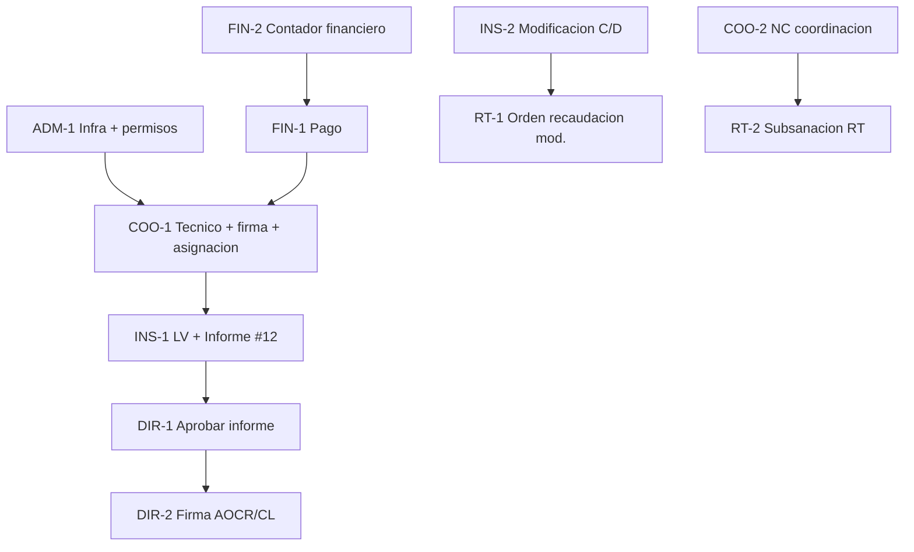

# Plan de cierre al 100% — por rol

**Fecha:** 2026-06-11  
**Objetivo:** cerrar brechas restantes del flujo integral AOCR, con **2 entregables concretos por rol** (1 prueba operativa + 1 cierre técnico o institucional).

**Referencias:** `AOCR_FLUJO_INTEGRAL_MATRICES.md` (§12 Definición de done) · `GUIA_PRUEBAS_POST_REPUBLICACION.md` · `GUIA_INSPECTOR_SOLICITUD_12.md`

---

## Criterio de “100% funcional” por rol

Un rol se considera **cerrado** cuando:

1. Sus **2 entregables** están marcados ✅ en la tabla de seguimiento (al final).
2. Bandeja = contador sidebar = acciones visibles = permisos backend.
3. No hay atajos de estado ni botones que prometan un cierre que el backend rechaza.

---

## RT / Solicitante

| # | Entregable | Acción concreta | Evidencia |
|---|------------|-----------------|-----------|
| **RT-1** | **Prueba Escenario B3 + C3** | Tras firma coordinador en emisión (#12): descargar constancia y confirmar que el estado **no** pasa a `Finalizado`. Si aplica mod. con aeropuertos: tras cierre inspector, usar **Generar orden de recaudación** en detalle. | Captura estado + PDF descargado |
| **RT-2** | **Subsanación NC (Fase 8)** | Con una inspección en ruta insatisfactoria **ya aprobada por coordinación**, cargar corrección documental desde `Inspeccion/Detalle` y verificar que el RT **no** puede subir antes de esa aprobación. | Log + estado solicitud |

**Rutas clave:** `/SolicitudAOCR/Detalle/{id}` · `/OrdenRecaudacion/Nueva` · menú **Modificación** (`tipoSolicitud=3`)

**Dev asociado (no bloquea RT-1):** migrar flags de botones RT restantes a `SolicitudAocrFlujoViewModel` (Fase 7).

---

## Financiero

| # | Entregable | Acción concreta | Evidencia |
|---|------------|-----------------|-----------|
| **FIN-1** | **Caso 1 — pago satisfactorio** | Aprobar comprobante de orden vinculada a solicitud de prueba; confirmar transición a documentación habilitada y correo idempotente (sin duplicados en cola/log). | Estado + 1 solo correo `event_key` |
| **FIN-2** | **Bandeja = contador** | Comparar sidebar financiero vs bandeja de órdenes pendientes; deben coincidir en conteo y filtros (`FinancialOrderStateHelper`). | Número sidebar = filas bandeja |

**Rutas clave:** bandeja financiero · detalle orden recaudación

**Dev asociado:** auditar correos post-aprobación en `AocrPostPagoWorkflowService` / `AocrEmailFlujoService` para todos los conceptos de orden.

---

## Coordinador / Coordinación (`GEN_COORDINACION`)

| # | Entregable | Acción concreta | Evidencia |
|---|------------|-----------------|-----------|
| **COO-1** | **Escenarios A + B completos** | `/Tecnico` sin texto fantasma → firma revisión final #12 → `Pendiente Asignacion RT` → asignar inspector sin error. | Checklist guía post-republicación |
| **COO-2** | **NC insatisfactoria (Caso 5)** | Desde `Inspeccion/Detalle` o dashboard `#pane-observaciones`: aprobar NC → solicitar nueva inspección **o** habilitar subsanación RT; verificar que el RT solo actúa después. | Estados + botones RT bloqueados/desbloqueados |

**Rutas clave:** `/Tecnico/Index` · `/SolicitudAOCR/Detalle/12` · `/CoordinacionJefatura/DashboardInspeccion#pane-observaciones`

**Dev asociado:** `[AocrAuthorize]` en acciones de modificación AOCR aún con `[Authorize(Roles)]` — alinear matriz Fase 4.

---

## Inspector

| # | Entregable | Acción concreta | Evidencia |
|---|------------|-----------------|-----------|
| **INS-1** | **Guía #12 hasta informe firmado** | Cierre documental → LV finalizada/firmada → Informe finalizado/firmado → envío a Dirección. Seguir `GUIA_INSPECTOR_SOLICITUD_12.md` al pie de la letra. | Badges LV firmada + Informe firmado |
| **INS-2** | **Escenario C o D (modificación)** | **C:** tipo 3 con aeropuertos → solo “Cerrar fase y derivar a inspección”. **D:** tipo 3 sin aeropuertos → ramas CL / derivar inspección clásicas. | Estado final + panel correcto |

**Rutas clave:** `/Inspeccion/Index` · `/Inspeccion/Detalle/{id}` · `/SolicitudAOCR/Detalle/{id}`

**Dev asociado:** unificar autorización en `InspeccionController` (eliminar híbrido legacy vs `AocrAuthorizationService`).

---

## DIRDAC / Dirección / DCAV

| # | Entregable | Acción concreta | Evidencia |
|---|------------|-----------------|-----------|
| **DIR-1** | **Aprobar informe #12 (Fase 8)** | En `Inspeccion/PendientesDireccion`, aprobar informe técnico firmado; solicitud debe pasar a fase AOCR elaboración/revisión según tipo. | Estado post-aprobación |
| **DIR-2** | **Firma AOCR o Condiciones mod.** | Firmar documento pendiente en bandeja dirección; liberar descarga final para RT. Validar PDF institucional (Fase 9). | PDF firmado + estado `AOCR Emitido` / equivalente |

**Rutas clave:** bandeja DIRDAC · `CoordinacionJefatura/ValidarAocr` · firmas pendientes

**Dev asociado:** revisión PDF por plantilla (aceptación documental, CL, AOCR) — Fase 9.

---

## Administrador

| # | Entregable | Acción concreta | Evidencia |
|---|------------|-----------------|-----------|
| **ADM-1** | **Caso 6 — URL directa** | Intentar acciones críticas sin rol (Generar AOCR, asignar inspector, cierre fase mod.) → debe responder **403** o redirección, no ejecutar transición. | Respuesta HTTP + log `[AUTH]` |
| **ADM-2** | **Inventario AOCR legacy** | `Health/Dashboard` → consultar candidatas legacy → resincronizar solo si aplica; documentar IDs afectados. | Resultado inventario/resync |

**Rutas clave:** `/Health/Dashboard` · pruebas con usuario sin rol

**Dev asociado:** completar `[AocrAuthorize]` en `InspeccionController` + tests `AocrModificationAuthorizationTests` ampliados.

---

## Orden recomendado de ejecución (dependencias)

1. **ADM-1** + reciclar IIS (base de seguridad).
2. **COO-1** + **FIN-1** (habilitan #12).
3. **INS-1** → **DIR-1** → **DIR-2** (cadena feliz emisión).
4. **INS-2** + **RT-1** (modificación nuevo aeropuerto).
5. **COO-2** + **RT-2** (rama insatisfactoria).
6. **ADM-2** + **FIN-2** (cierre operativo y contadores).

---

## Seguimiento — 2 por rol

| Rol | Entregable 1 | ☐ | Entregable 2 | ☐ |
|-----|--------------|---|--------------|---|
| RT | RT-1 Descarga + orden mod. | ☐ | RT-2 Subsanación NC | ☐ |
| Financiero | FIN-1 Pago + correo | ☐ | FIN-2 Contador = bandeja | ☐ |
| Coordinación | COO-1 Tecnico + #12 asignación | ☐ | COO-2 NC formal | ☐ |
| Inspector | INS-1 LV + Informe #12 | ☐ | INS-2 Mod. C/D | ☐ |
| DIRDAC | DIR-1 Aprobar informe | ☐ | DIR-2 Firma final | ☐ |
| Administrador | ADM-1 Permisos URL | ☐ | ADM-2 Legacy AOCR | ☐ |

**Meta global:** las **12 casillas** marcadas ✅ = flujo integral validado por rol.

---

## Qué queda en desarrollo (transversal, no asignado a un solo rol)

| Fase | Responsable sugerido | Entregable |
|------|---------------------|------------|
| **4** | Dev backend | `[AocrAuthorize]` completo en `InspeccionController` + modificación AOCR |
| **7** | Dev frontend | Botones `Detalle.cshtml` / `_FormularioEmisionAOCR.cshtml` → ViewModel |
| **9** | Dev + Legal/DIRDAC | Revisión PDFs institucionales |
| **10** | Dev QA | Casos 1–10 automatizados o checklist firmado |

---

*Última actualización: 2026-06-11*
